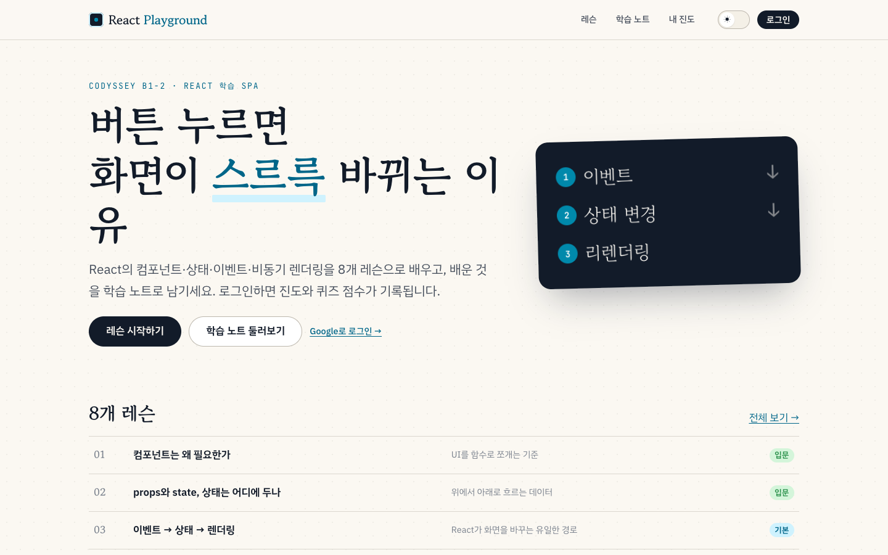
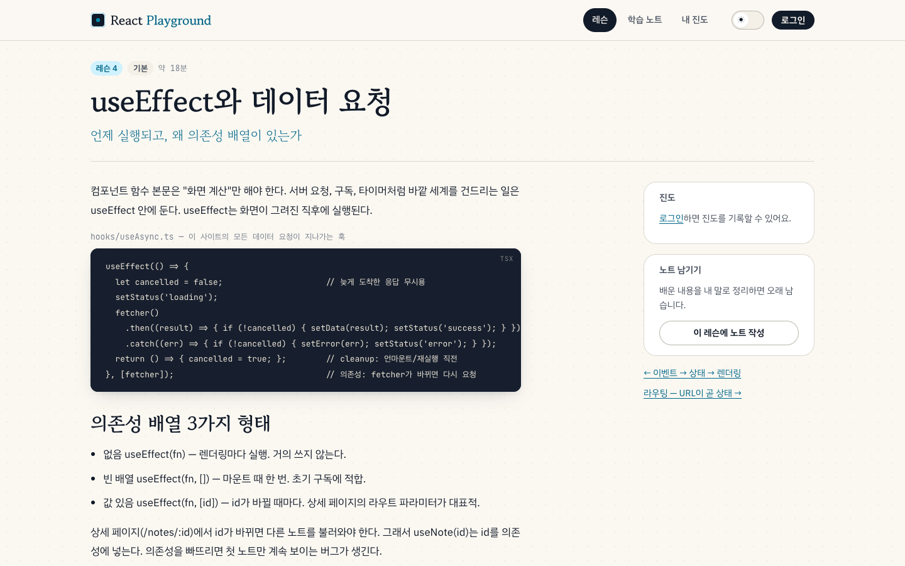
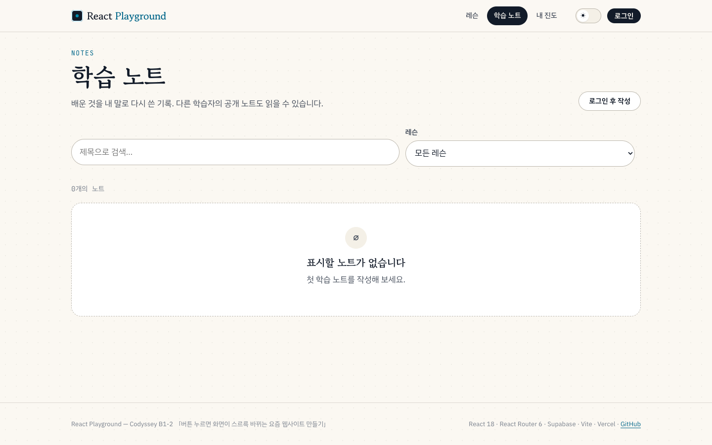
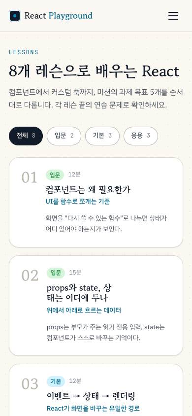

# React Playground — 버튼 누르면 화면이 스르륵 바뀌는 React 학습 사이트

React 18 + React Router 6 + Supabase로 만든 **React 학습용 SPA**입니다. 8개 레슨(컴포넌트 → props/state → 이벤트·렌더링 → useEffect → 라우팅 → 폼 → 로딩/에러/빈 상태 → 커스텀 훅)을 읽고, 레슨마다 연습 문제를 풀고, 배운 것을 **학습 노트**로 남깁니다. 로그인하면 **진도**와 **퀴즈 점수**가 기록됩니다. (Codyssey B1-2 미션)

- **배포 URL**: https://codyssey-b1-2-react.vercel.app
- **저장소**: https://github.com/newids/codyssey-b1-2
- **문서**: [미션 수행 가이드](docs/GUIDE.md) · [평가 설명서](docs/EVALUATION.md) · [평가 항목 답변 (빠른 버전)](docs/EVALUATION-QUICK.md) · [설정 가이드 (Supabase · Google 로그인 · Vercel)](docs/SETUP.md)

## 문서

| 문서 | 내용 | 대상 |
| --- | --- | --- |
| [미션 수행 가이드](docs/GUIDE.md) | 미션 요구사항을 어떤 순서로, 어떤 판단으로 구현했는지. 이 저장소 코드를 기준으로 한 단계별 가이드 | 학습자 |
| [평가 설명서](docs/EVALUATION.md) | 요구사항 ↔ 구현 매핑(파일·행), 과제 목표 5개 상세 답변, "이벤트 → 상태 → 렌더링" 증빙 지점, 수동 QA 시나리오 | 평가자 · 구술 평가 준비 |
| [평가 항목 답변 (빠른 버전)](docs/EVALUATION-QUICK.md) | 같은 내용을 문항당 30초~2분 답변으로 줄인 버전 | 구술 답변 연습 |
| [설정 가이드](docs/SETUP.md) | 로컬 실행, Supabase 스키마·RLS, 환경변수, Google OAuth 설정, Vercel 배포 | 재현·운영 |

## 스크린샷

| 홈 (데스크톱) | 레슨 상세 |
| --- | --- |
|  |  |

| 학습 노트 목록 — 빈 상태 | 레슨 목록 (모바일) |
| --- | --- |
|  |  |

> 배포 URL에서 캡쳐. 2026-09-22.

## 실행 방법

```bash
git clone https://github.com/newids/codyssey-b1-2.git
cd codyssey-b1-2
pnpm install          # 또는 npm install
cp .env.example .env  # VITE_SUPABASE_URL, VITE_SUPABASE_ANON_KEY 입력
pnpm dev              # http://localhost:5173
```

| 명령 | 설명 |
| --- | --- |
| `pnpm dev` | 개발 서버 |
| `pnpm build` | 타입 검사 + 프로덕션 빌드 (`dist/`) |
| `pnpm preview` | 빌드 결과 미리보기 |
| `pnpm test` | Vitest 테스트 (57개) |
| `pnpm test:coverage` | 커버리지 리포트 |

Supabase 프로젝트 생성·스키마·Google 로그인·Vercel 배포 절차는 [docs/SETUP.md](docs/SETUP.md)에 있습니다.

## 사용 기술

| 영역 | 내용 |
| --- | --- |
| UI | React 18.3 (함수 컴포넌트 + 훅), TypeScript 5.5 |
| 라우팅 | React Router 6.26 — 라우트 10개, 중첩 레이아웃, 보호 라우트, `useParams` / `useSearchParams` |
| 상태 | 지역 state(`useState`), 전역 Context 3개(Auth · Theme · Toast), 커스텀 훅 6개, `useMemo` / `useCallback` / `React.memo` |
| 백엔드 | Supabase (Postgres + Auth + RLS). `@supabase/supabase-js` 2.x |
| 인증 | Supabase Auth — Google OAuth, 이메일 매직 링크 |
| 스타일 | CSS Modules + CSS 커스텀 프로퍼티(oklch 색, clamp() 유동 크기), 다크 모드, `prefers-reduced-motion` |
| 빌드·테스트 | Vite 5, Vitest 2 + Testing Library |
| 배포 | Vercel (SPA rewrite + 보안 헤더), 환경변수는 Vercel 대시보드 |

## 라우트

| 경로 | 페이지 | 보호 | 설명 |
| --- | --- | --- | --- |
| `/` | HomePage | | 소개, 레슨 목록 요약 |
| `/login` | LoginPage | | Google / 이메일 링크 로그인, 로그인 후 원래 경로로 복귀 |
| `/lessons` | LessonListPage | | 레슨 8개, 난이도 필터, 진도 바 |
| `/lessons/:slug` | LessonDetailPage | | 본문, 연습 문제(채점·점수 저장), 완료 표시, 관련 노트 |
| `/notes` | NoteListPage | | 노트 목록(검색·레슨 필터·내 노트, URL 쿼리 동기화) |
| `/notes/:id` | NoteDetailPage | | 상세, 본인이면 수정·삭제 |
| `/notes/new` | NoteNewPage | ✓ | 등록 폼 (검증·미리보기·제출 중 상태) |
| `/notes/:id/edit` | NoteEditPage | ✓ | 수정 폼 |
| `/profile` | ProfilePage | ✓ | 진도, 퀴즈 최고 점수, 내 노트 |
| `*` | NotFoundPage | | 404 |

## 폴더 구조

```
src/
  pages/            라우트 단위 화면 10개 — 데이터를 가져오고 조립만 한다
  components/
    ui/             재사용 UI 14개 — Button, Input/Textarea, Select, Card, Badge, Loading, ErrorState,
                    EmptyState, AsyncBoundary, ProgressBar, Toast, ThemeToggle, CodeBlock, Avatar
    layout/         Layout, Header, Footer, PageHeader
    notes/          NoteCard, NoteGrid, NoteForm
    lessons/        LessonCard, LessonContent, Quiz
    auth/           ProtectedRoute
  hooks/            useAsync, useNotes(useNote), useNoteForm, useLessonProgress, useQuizAttempts, useDebounce
  context/          AuthContext, ThemeContext, ToastContext
  lib/              supabase 클라이언트, api/(notes · progress · auth), validation, errors, format, quiz, types
  data/lessons.ts   레슨 8개 본문 + 퀴즈 (정적 데이터)
  styles/           tokens.css (디자인 토큰), global.css
supabase/migrations 스키마 + RLS
docs/               가이드 · 평가 설명서 · 설정 가이드
```

## 핵심 데이터 흐름 (하나의 기능이 관통하는 경로)

```
URL /notes/:id
 → useParams()                          라우팅
 → <NoteDetailPage>                     페이지 컴포넌트
 → useNote(id)                          커스텀 훅 (useCallback으로 fetcher 고정)
 → useAsync(fetcher)                    useEffect: status 'loading' → 요청 → 'success' | 'error'
 → <AsyncBoundary status=…>             로딩 / 에러 / 빈 / 성공 4분기
 → <article>…</article>                 렌더링
 → 삭제 버튼 클릭 → deleteNote() → navigate('/notes') + Toast     이벤트 → 상태 → 화면 전환
```

## 상태 변경이 렌더링 변화로 이어지는 지점

| # | 이벤트 | 상태 | 렌더링 변화 | 위치 |
| --- | --- | --- | --- | --- |
| 1 | 검색어 입력 / 레슨 선택 / 내 노트 토글 | URL 쿼리 → `useNotes` 파라미터 | 목록 재조회·재렌더 | `NoteListPage` |
| 2 | 제목·내용 타이핑 | `useNoteForm.values` | 오른쪽 미리보기 카드 즉시 갱신, 검증 에러 | `NoteForm` |
| 3 | 퀴즈 보기 선택 → 채점 | `answers`, `isGraded` | 채점 버튼 활성화 → 정답/오답 색·해설 | `Quiz` |
| 4 | 저장·삭제 성공 | `ToastContext.toasts` | 하단 알림 표시 후 자동 소멸 | `ToastProvider` |
| 5 | 테마 토글 | `ThemeContext.theme` | 전체 색상 전환 (`data-theme`) | `ThemeToggle` |
| 6 | 레슨 완료 클릭 | `useLessonProgress` (낙관적 업데이트) | 진도 바·완료 배지 즉시 반영, 실패 시 롤백 | `LessonDetailPage` |
| 7 | 난이도 필터 | `level` | 레슨 카드 목록 필터 (`useMemo`) | `LessonListPage` |

## 보너스 과제

| 항목 | 구현 |
| --- | --- |
| 전역 상태 | `AuthContext`(로그인 사용자), `ThemeContext`(테마, localStorage 유지), `ToastContext`(알림) |
| 성능 최적화 | `React.memo(NoteCard)`, `React.memo(LessonCard)`, `useMemo`(필터·검증·최고점 계산), `useCallback`(fetcher·핸들러) |
| 인증 | Supabase Auth Google OAuth + 이메일 매직 링크, `ProtectedRoute`로 3개 라우트 보호, 로그인 후 원래 경로 복귀 |

## 테스트

```bash
pnpm test              # 11개 파일, 57개 테스트
pnpm test:coverage
```

순수 로직(`validation`, `format`, `errors`, `quiz`), 훅(`useAsync` 경쟁 상태·재요청·cleanup, `useNoteForm`, `useDebounce`, `summarizeAttempts`), 컴포넌트(`Button`, `Input`, `AsyncBoundary` 4분기, `ProgressBar`, `EmptyState`, `Quiz` 이벤트→상태→렌더링, `NoteForm` 검증·제출 중·실패 표시)를 다룹니다. Supabase 네트워크에 의존하는 페이지·API 계층은 배포 URL에서 수동 QA로 확인합니다 ([평가 설명서 §6](docs/EVALUATION.md)).
