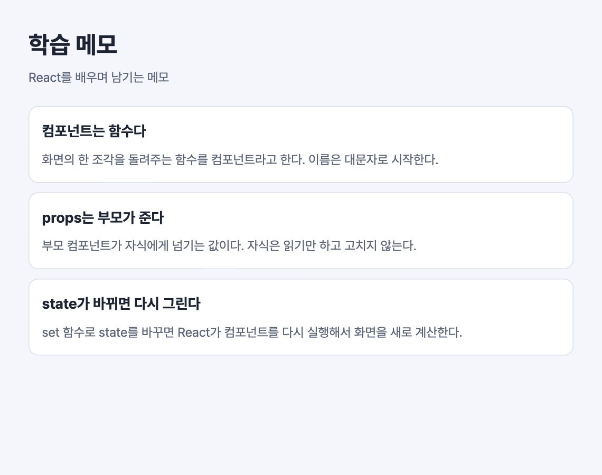

# 실습 0. 실습 프로젝트 실행하기

1일 차 · 13분

## 이번 실습에서 하는 것

실습 프로젝트를 실행하고, 코드를 고치면 화면이 바로 바뀌는 것을 확인한다. TypeScript가 오류를 미리 알려 주는 것도 한 번 본다.



## 단계

### 1. 프로젝트 열고 실행하기

1. VS Code에서 `course/code/memo-app` 폴더를 연다.
2. 메뉴 **터미널 → 새 터미널**을 열고 아래를 입력한다. (사전 준비 때 `npm install`을 했다면 두 번째 줄만)

   ```bash
   npm install
   npm run dev
   ```

3. 터미널에 나온 주소(`http://localhost:5173`)를 브라우저에서 연다.

**화면에서 볼 것**: "학습 메모" 제목과 카드 3장.

### 2. 폴더 구조 보기

VS Code 왼쪽 탐색기에서 아래 파일을 하나씩 열어 본다. 고치지 않고 읽기만 한다.

| 파일 | 역할 |
| --- | --- |
| `index.html` | 브라우저가 처음 받는 파일. `<div id="root">` 한 줄뿐이다 |
| `src/main.tsx` | `root` 안에 `App` 컴포넌트를 그리라고 React에 시키는 시작점 |
| `src/App.tsx` | 지금 화면 전체. **오늘 주로 고칠 파일** |
| `src/styles.css` | 미리 준비해 둔 스타일. 고치지 않는다 |
| `src/types.ts` | 메모 데이터의 모양(타입) |
| `src/data/sampleNotes.ts` | 예시 메모 3개 (실습 2부터 쓴다) |
| `src/storage.ts`, `src/api/tips.ts` | 3일 차에 쓸 파일. 지금은 열지 않아도 된다 |

**설명해 보기**: `index.html`에는 "학습 메모"라는 글자가 없다. 그 글자는 어느 파일에서 오는가?

### 3. 글자를 고쳐 보기

`src/App.tsx`에서 아래 줄을 찾아 글자를 바꾸고 저장한다.

```tsx
// src/App.tsx
<p className="header-meta">React를 배우며 남기는 메모</p>
```

예: `<p className="header-meta">홍길동의 React 메모</p>`

**화면에서 볼 것**: 브라우저를 새로 고치지 않아도 글자가 바뀐다.

### 4. 일부러 오류 내 보기

오류 메시지는 앞으로 계속 보게 된다. 지금 한 번 일부러 내 본다.

**(1) JSX 오류** — `</header>`를 지우고 저장한다.

- 브라우저에 빨간 오류 창이 뜬다. 메시지에 파일 이름과 줄 번호가 있다.
- 되돌리고(`Ctrl + Z`) 저장하면 오류 창이 사라진다.

**(2) 타입 오류** — `src/data/sampleNotes.ts`를 열고 첫 메모의 `isImportant: true`를 `isImportant: '예'`로 바꾼다.

- VS Code가 그 줄에 빨간 밑줄을 긋는다. 마우스를 올리면 `'string' 형식은 'boolean' 형식에 할당할 수 없습니다`(영어 메뉴라면 `Type 'string' is not assignable to type 'boolean'`)라는 메시지가 나온다.
- 브라우저 화면은 그대로다. **TypeScript의 오류는 실행하기 전에, 편집기에서 알려 준다.**
- 되돌리고 저장한다.

## 확인 항목

- [ ] 브라우저에서 메모 카드 3장이 보인다.
- [ ] 글자를 고치고 저장하면 화면이 바로 바뀐다.
- [ ] JSX 오류를 내고, 메시지에서 줄 번호를 찾았다.
- [ ] 타입 오류의 빨간 밑줄 메시지를 읽어 봤다.
- [ ] 오류를 모두 되돌려 화면이 처음과 같다.

## 막혔을 때

| 증상 | 확인할 것 |
| --- | --- |
| `npm run dev`에서 `vite: command not found` | `npm install`을 먼저 실행한다. 터미널의 현재 폴더가 `memo-app`인지 확인한다 |
| 주소를 열어도 빈 화면 | 터미널에 나온 주소의 포트 번호가 `5173`이 아닐 수 있다. 터미널의 주소를 그대로 연다 |
| 고쳤는데 화면이 안 바뀐다 | 저장했는지 확인한다. 파일 탭 이름 옆에 점(●)이 있으면 아직 저장 전이다 |
| 터미널에 아무것도 입력이 안 된다 | 개발 서버가 실행 중이다. 그대로 두고, 다른 명령은 터미널 `+` 버튼으로 새 터미널을 열어 입력한다 |
