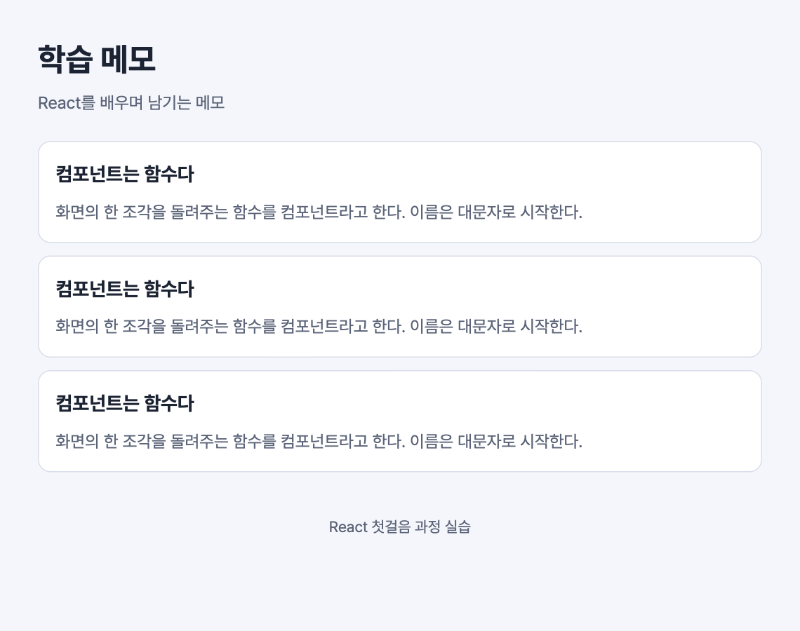

# 실습 1. 화면을 컴포넌트로 나누기

1일 차 · 23분 · 시작 상태: `starter`

## 이번 실습에서 만드는 것

`App.tsx` 하나에 다 들어 있는 화면을 `Header`, `NoteList`, `NoteCard` 컴포넌트로 나눈다. 화면은 거의 그대로이고 코드의 구조가 바뀐다.

```
App
├─ Header
├─ NoteList
│   ├─ NoteCard
│   ├─ NoteCard
│   └─ NoteCard
└─ Footer (도전 과제)
```



카드 3장의 내용이 모두 같아지는 것이 정상이다. 이유는 4단계에서 확인한다.

## 단계

### 1. Header 컴포넌트 만들기

`src` 아래에 `components` 폴더를 만들고, 그 안에 `Header.tsx` 파일을 만든다.

```tsx
// src/components/Header.tsx
export default function Header() {
  return (
    <header className="header">
      <h1 className="header-title">학습 메모</h1>
      <p className="header-meta">React를 배우며 남기는 메모</p>
    </header>
  );
}
```

- 컴포넌트는 **JSX를 돌려주는 함수**다.
- 이름은 **대문자**로 시작한다. 소문자로 시작하면 React가 HTML 태그로 착각한다.
- `export default`가 있어야 다른 파일에서 가져다 쓸 수 있다.

### 2. App에서 Header 쓰기

`App.tsx`에서 두 군데만 고친다. `<main>` 안의 `<ul>…</ul>`은 **지우지 않고 그대로 둔다.**

1. 파일 맨 위에 import 한 줄을 추가한다.

   ```tsx
   // src/App.tsx — 맨 위
   import Header from './components/Header';
   ```

2. `<header className="header">`부터 `</header>`까지 4줄을 지우고 그 자리에 아래 한 줄을 넣는다.

   ```tsx
   <Header />
   ```

**화면에서 볼 것**: 아무것도 달라지지 않는다. 달라지지 않았다면 성공이다.

### 3. NoteCard 컴포넌트 만들기

카드 한 장을 컴포넌트로 만든다. 첫 번째 카드의 `<li>…</li>`를 옮겨 온다.

```tsx
// src/components/NoteCard.tsx
export default function NoteCard() {
  return (
    <li className="note-card">
      <h2 className="note-title">컴포넌트는 함수다</h2>
      <p className="note-body">
        화면의 한 조각을 돌려주는 함수를 컴포넌트라고 한다. 이름은 대문자로 시작한다.
      </p>
    </li>
  );
}
```

### 4. NoteList 컴포넌트 만들기

목록 컴포넌트를 만들고 그 안에서 `NoteCard`를 세 번 쓴다.

```tsx
// src/components/NoteList.tsx
import NoteCard from './NoteCard';

export default function NoteList() {
  return (
    <ul className="note-list">
      <NoteCard />
      <NoteCard />
      <NoteCard />
    </ul>
  );
}
```

### 5. App 정리하기

`App.tsx`에서 `<ul>…</ul>` 전체를 `<NoteList />`로 바꾼다. 완성된 `App.tsx`는 아래와 같다.

```tsx
// src/App.tsx
import Header from './components/Header';
import NoteList from './components/NoteList';

export default function App() {
  return (
    <div className="app">
      <Header />
      <main>
        <NoteList />
      </main>
    </div>
  );
}
```

**화면에서 볼 것**: 카드 3장이 모두 "컴포넌트는 함수다"로 같다.

**설명해 보기**

1. `App.tsx`가 34줄에서 13줄로 줄었다. 이제 `App.tsx`만 읽고 화면이 어떤 부분으로 이루어졌는지 말할 수 있는가?
2. 카드 3장이 모두 같은 이유는 무엇인가? 카드마다 다른 내용을 보여 주려면 `NoteCard`에 무엇이 필요할까? (다음 실습의 주제다)

## 확인 항목

- [ ] `src/components` 폴더에 `Header.tsx`, `NoteCard.tsx`, `NoteList.tsx`가 있다.
- [ ] `App.tsx`에 `<header>`, `<ul>`, `<li>` 태그가 남아 있지 않다.
- [ ] 화면에 제목과 같은 내용의 카드 3장이 보인다.
- [ ] 컴포넌트 트리(`App → Header, NoteList → NoteCard`)를 코드에서 짚을 수 있다.

## 막혔을 때

| 증상 | 확인할 것 |
| --- | --- |
| `Failed to resolve import "./components/Header"` | 파일 위치와 이름을 확인한다. `src/components/Header.tsx`여야 하고 대소문자도 같아야 한다 |
| `'Header'이(가) 정의되지 않았습니다` 또는 빨간 밑줄 | `App.tsx` 맨 위에 `import Header from './components/Header';`가 있는지 확인한다 |
| 화면에 아무것도 안 나오고 오류도 없다 | 컴포넌트 이름을 소문자(`<header />`, `<noteList />`)로 쓰지 않았는지 확인한다 |
| `JSX 식에는 부모 요소가 하나 있어야 합니다` | `return ( … )` 안의 가장 바깥 태그가 하나인지 확인한다 |
| `does not provide an export named 'default'` | 컴포넌트 파일에 `export default`가 빠졌다 |

## 도전 과제

바닥글 컴포넌트를 만들어 `App`의 `</main>` 아래에 넣는다.

```tsx
// src/components/Footer.tsx
export default function Footer() {
  return <footer className="footer">React 첫걸음 과정 실습</footer>;
}
```
