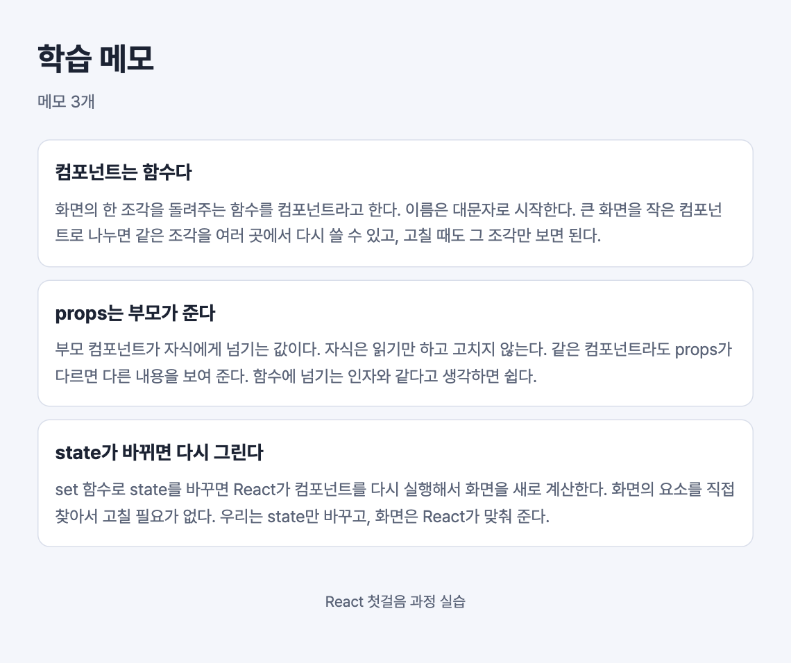

# 실습 2. props로 메모 목록 그리기

1일 차 · 15분 · 시작 상태: `lab1`

## 이번 실습에서 만드는 것

`NoteCard`가 props로 메모를 받아서 카드마다 다른 내용을 보여 준다. 메모 데이터는 `src/data/sampleNotes.ts`의 배열에서 가져온다.



데이터가 흐르는 방향은 한쪽이다.

```
App (sampleNotes)
  └─ notes ─▶ NoteList
                └─ note ─▶ NoteCard
```

## 단계

### 1. 데이터와 타입 읽기

두 파일을 열어 읽는다. 고치지 않는다.

```ts
// src/types.ts
export type Note = {
  id: number;
  title: string;
  body: string;
  isImportant: boolean;
};
```

```ts
// src/data/sampleNotes.ts
export const sampleNotes: Note[] = [ … ];
```

- `type Note = {…}`는 "메모 하나는 이런 모양이다"라는 선언이다.
- `Note[]`는 "`Note`가 여러 개 들어 있는 배열"이라는 뜻이다.

### 2. NoteCard가 props를 받게 하기

```tsx
// src/components/NoteCard.tsx
import type { Note } from '../types';

type Props = {
  note: Note;
};

export default function NoteCard({ note }: Props) {
  return (
    <li className="note-card">
      <h2 className="note-title">{note.title}</h2>
      <p className="note-body">{note.body}</p>
    </li>
  );
}
```

- `type Props`는 "이 컴포넌트는 `note`라는 값을 받는다"는 선언이다.
- `{ note }: Props`는 받은 props에서 `note`를 꺼내 쓰겠다는 뜻이다.
- JSX 안의 `{ }`에는 JavaScript 값을 넣는다. `{note.title}`은 메모의 제목이다.

저장하면 `NoteList.tsx`의 `<NoteCard />`에 빨간 밑줄이 생긴다. "`note`를 줘야 하는데 안 줬다"는 뜻이다. 다음 단계에서 고친다.

### 3. NoteList가 배열을 받아 map으로 그리기

```tsx
// src/components/NoteList.tsx
import type { Note } from '../types';
import NoteCard from './NoteCard';

type Props = {
  notes: Note[];
};

export default function NoteList({ notes }: Props) {
  return (
    <ul className="note-list">
      {notes.map((note) => (
        <NoteCard key={note.id} note={note} />
      ))}
    </ul>
  );
}
```

- `notes.map(…)`은 메모 배열을 `<NoteCard />` 배열로 바꾼다. 메모가 3개면 카드가 3장, 10개면 10장이다.
- `key`는 React가 목록의 항목을 구별하는 이름표다. 목록 안에서 겹치지 않는 값(여기서는 `id`)을 준다.

이번에는 `App.tsx`의 `<NoteList />`에 빨간 밑줄이 생긴다. `notes`를 안 줬기 때문이다. 다음 단계에서 고친다.

### 4. App에서 데이터 내려보내기

```tsx
// src/App.tsx
import Header from './components/Header';
import NoteList from './components/NoteList';
import { sampleNotes } from './data/sampleNotes';

export default function App() {
  return (
    <div className="app">
      <Header title="학습 메모" count={sampleNotes.length} />
      <main>
        <NoteList notes={sampleNotes} />
      </main>
    </div>
  );
}
```

(실습 1의 도전 과제를 했다면 `Footer`는 그대로 둔다.)

`<Header title=… count=… />`에 빨간 밑줄이 생긴다. `Header`가 아직 props를 받을 줄 모르기 때문이다. 다음 단계에서 고친다.

### 5. Header도 props를 받게 하기

```tsx
// src/components/Header.tsx
type Props = {
  title: string;
  count: number;
};

export default function Header({ title, count }: Props) {
  return (
    <header className="header">
      <h1 className="header-title">{title}</h1>
      <p className="header-meta">메모 {count}개</p>
    </header>
  );
}
```

- 글자는 `title="학습 메모"`처럼 따옴표로, 그 밖의 값은 `count={3}`처럼 중괄호로 넘긴다.

**화면에서 볼 것**: 카드 3장의 내용이 서로 다르고, 제목 아래에 "메모 3개"가 보인다.

### 6. 데이터를 바꿔 보기

`src/data/sampleNotes.ts`에 메모를 하나 더 추가하고 저장한다. 기존 항목을 복사해서 `id`를 `4`로, 제목과 내용을 원하는 대로 바꾸면 된다.

**화면에서 볼 것**: 컴포넌트 코드는 건드리지 않았는데 카드가 4장이 되고 "메모 4개"로 바뀐다.

확인했으면 추가한 메모를 지워 3개로 되돌린다. 뒤 실습의 설명과 화면 캡처가 메모 3개를 기준으로 한다.

**설명해 보기**

1. `NoteCard`는 자기가 몇 번째 카드인지, 전체 메모가 몇 개인지 아는가?
2. `NoteCard` 안에서 `note.title = '바꾼 제목'`처럼 props를 고치면 안 된다. 왜 그럴까?
3. `<NoteList notes={sampleNotes} />`에서 `notes=`를 `memo=`로 바꾸면 어떤 일이 생기는가? (직접 해 보고 되돌린다)

## 확인 항목

- [ ] 카드마다 제목과 내용이 다르다.
- [ ] 제목 아래에 메모 개수가 보인다.
- [ ] `sampleNotes.ts`에 메모를 추가하면 카드가 늘어나는 것을 확인하고 되돌렸다.
- [ ] VS Code에 빨간 밑줄이 없다.
- [ ] 브라우저 개발자 도구(F12) 콘솔에 경고가 없다.

## 막혔을 때

| 증상 | 확인할 것 |
| --- | --- |
| `'note' 속성이 … 형식에 없지만 'Props' 형식에서 필수입니다` | 그 컴포넌트를 쓰는 곳에서 `note={…}`를 넘겼는지 확인한다 |
| 콘솔에 `Each child in a list should have a unique "key" prop` | `map` 안의 `<NoteCard>`에 `key={note.id}`가 있는지 확인한다 |
| 콘솔에 `Encountered two children with the same key` | `sampleNotes.ts`에 `id`가 같은 메모가 있다 |
| 화면에 `{note.title}`이 글자 그대로 나온다 | 중괄호가 따옴표 안에 들어가 있지 않은지 확인한다 |
| `notes.map is not a function` | `notes={sampleNotes}`가 아니라 `notes="sampleNotes"`처럼 따옴표로 넘기지 않았는지 확인한다 |

## 도전 과제

`NoteList.tsx`에서 `key={note.id}`를 지우고 저장한 뒤 콘솔의 경고를 읽어 본다. 읽었으면 되돌린다.
