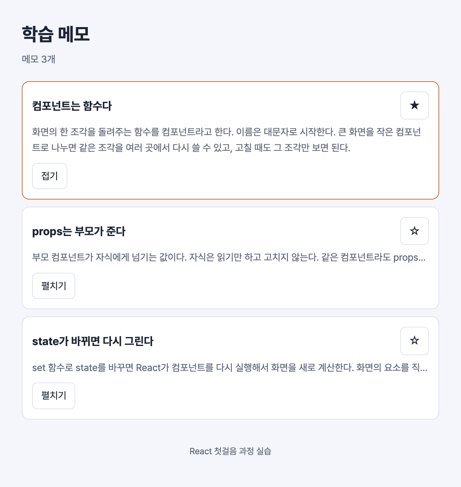

# 실습 3. 카드 펼치기와 중요 표시

2일 차 · 20분 · 시작 상태: `lab2`

## 이번 실습에서 만드는 것

카드에 버튼 두 개를 붙인다. "펼치기"를 누르면 본문 전체가 보이고, 별(☆)을 누르면 중요 표시가 된다. 처음으로 화면이 클릭에 반응한다.



모든 변화는 같은 순서로 일어난다.

```
클릭 → 이벤트 핸들러 실행 → set 함수 호출 → 컴포넌트 다시 실행 → 새 화면
```

## 단계

### 1. 펼침 상태 만들기

`NoteCard.tsx`에 state를 하나 만든다.

```tsx
// src/components/NoteCard.tsx
import { useState } from 'react';
import type { Note } from '../types';

type Props = {
  note: Note;
};

export default function NoteCard({ note }: Props) {
  const [isOpen, setIsOpen] = useState(false);

  function handleToggleOpen() {
    setIsOpen(!isOpen);
  }

  return (
    <li className="note-card">
      <h2 className="note-title">{note.title}</h2>
      <p className={isOpen ? 'note-body' : 'note-body is-collapsed'}>{note.body}</p>

      <div className="note-actions">
        <button type="button" className="btn" aria-expanded={isOpen} onClick={handleToggleOpen}>
          {isOpen ? '접기' : '펼치기'}
        </button>
      </div>
    </li>
  );
}
```

- `useState(false)`는 "처음 값이 `false`인 기억 하나"를 만든다. 지금 값(`isOpen`)과 값을 바꾸는 함수(`setIsOpen`)를 돌려준다.
- `onClick={handleToggleOpen}`은 "클릭하면 이 함수를 실행해 달라"는 뜻이다. `handleToggleOpen()`처럼 괄호를 붙이지 않는다.
- `isOpen ? A : B`는 "`isOpen`이 참이면 A, 아니면 B"다. 버튼 글자와 본문의 클래스가 state에 따라 정해진다.
- `aria-expanded`는 화면을 보지 못하는 사용자에게 펼쳐졌는지를 알려 주는 속성이다.

**화면에서 볼 것**: 본문이 한 줄로 줄어들고, "펼치기"를 누르면 전체가 보이며 버튼 글자가 "접기"로 바뀐다. 카드마다 따로 펼쳐진다.

### 2. 중요 표시 만들기

state를 하나 더 만들고 별 버튼을 붙인다. 컴포넌트 함수 전체를 아래로 바꾼다. 위쪽의 import와 `type Props`는 그대로 둔다.

1단계와 달라진 곳은 세 군데다: `isImportant` state와 핸들러, `<li>`의 `className`, 제목을 감싼 `<div className="note-head">`와 별 버튼.

```tsx
// src/components/NoteCard.tsx
export default function NoteCard({ note }: Props) {
  const [isOpen, setIsOpen] = useState(false);
  const [isImportant, setIsImportant] = useState(note.isImportant);

  function handleToggleOpen() {
    setIsOpen(!isOpen);
  }

  function handleToggleImportant() {
    setIsImportant(!isImportant);
  }

  return (
    <li className={isImportant ? 'note-card is-important' : 'note-card'}>
      <div className="note-head">
        <h2 className="note-title">{note.title}</h2>
        <button
          type="button"
          className="btn star"
          aria-label={isImportant ? '중요 표시 끄기' : '중요 표시 켜기'}
          onClick={handleToggleImportant}
        >
          {isImportant ? '★' : '☆'}
        </button>
      </div>

      <p className={isOpen ? 'note-body' : 'note-body is-collapsed'}>{note.body}</p>

      <div className="note-actions">
        <button type="button" className="btn" aria-expanded={isOpen} onClick={handleToggleOpen}>
          {isOpen ? '접기' : '펼치기'}
        </button>
      </div>
    </li>
  );
}
```

- `useState(note.isImportant)`는 메모 데이터의 값을 처음 값으로 쓴다. 그래서 첫 번째 카드만 처음부터 ★이다.

**화면에서 볼 것**: 별을 누르면 ★/☆가 바뀌고 카드 테두리 색이 달라진다.

### 3. 일반 변수로는 왜 안 되는지 확인하기

state 대신 일반 변수를 쓰면 어떻게 되는지 직접 본다. 컴포넌트 함수 안에서 `handleToggleOpen`을 잠깐 아래처럼 바꾸고, 그 바로 위에 `let count = 0;`을 넣는다.

```tsx
let count = 0;

function handleToggleOpen() {
  count = count + 1;
  console.log('클릭 횟수', count);
}
```

브라우저 개발자 도구(F12)의 콘솔을 열고 "펼치기"를 여러 번 누른다.

**화면에서 볼 것**: 콘솔의 숫자는 올라가는데 화면은 그대로다. React는 **set 함수가 불렸을 때만** 화면을 다시 그린다.

확인했으면 `let count` 줄을 지우고 `handleToggleOpen`을 원래대로(`setIsOpen(!isOpen);`) 되돌린다.

**설명해 보기**

1. 첫 번째 카드를 펼쳐도 두 번째 카드는 그대로다. `isOpen`은 어디에 몇 개 있는가?
2. 버튼을 눌렀을 때 일어나는 일을 "클릭 → … → 새 화면" 순서로 말해 본다.
3. 제목 아래 "메모 3개" 옆에 "중요 1개"를 보여 주고 싶다. `Header`는 어느 카드가 중요한지 알 수 있는가? (다음 실습의 주제다)

## 확인 항목

- [ ] "펼치기"를 누르면 본문 전체가 보이고 버튼이 "접기"로 바뀐다.
- [ ] 별을 누르면 ★/☆와 테두리 색이 바뀐다.
- [ ] 카드마다 따로 동작한다.
- [ ] 일반 변수로는 화면이 바뀌지 않는 것을 확인하고 되돌렸다.

## 막혔을 때

| 증상 | 확인할 것 |
| --- | --- |
| `useState is not defined` | 파일 맨 위에 `import { useState } from 'react';`가 있는지 확인한다 |
| 화면이 멈추고 `Too many re-renders` | `onClick={handleToggleOpen()}`처럼 괄호를 붙였다. 괄호를 뺀다 |
| 눌러도 아무 변화가 없다 | `onClick`의 철자(대문자 C)와, 핸들러 안에서 set 함수를 부르는지 확인한다 |
| `Invalid hook call` | `useState`를 컴포넌트 함수 **안, 맨 위**에서 부르는지 확인한다. 핸들러나 `if` 안에서 부르면 안 된다 |
| 본문이 처음부터 다 보인다 | 브라우저 창이 넓으면 본문이 한 줄에 다 들어간다. 창을 좁혀 본다 |
