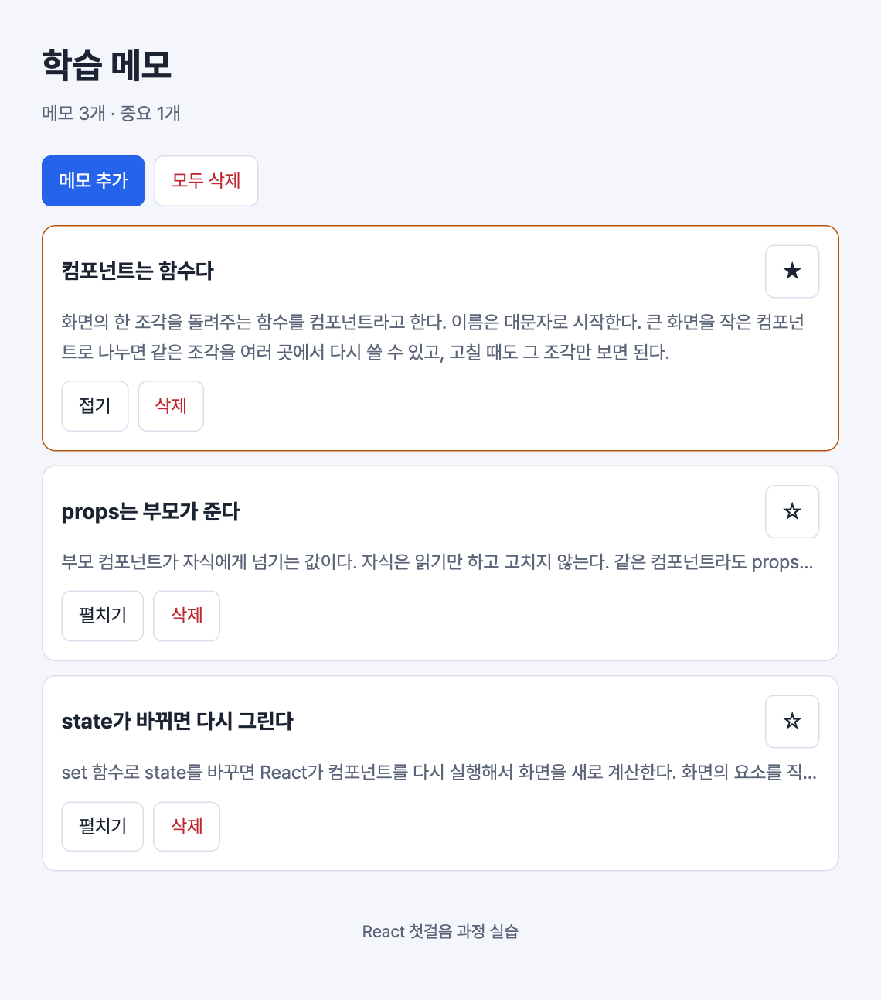

# 실습 4. 메모 추가와 삭제

2일 차 · 30분 · 시작 상태: `lab3`

## 이번 실습에서 만드는 것

메모 배열을 `App`의 state로 만들고, 메모를 추가·삭제·중요 표시한다. 제목 아래에 중요 메모 개수도 보여 준다.



실습 3에서는 중요 여부를 카드가 각자 기억했다. 그러면 `Header`가 중요 메모 개수를 알 수 없다. 그래서 그 기억을 두 컴포넌트의 공통 부모인 `App`으로 옮긴다. 이것을 **state 끌어올리기**라고 한다.

```
App  [notes]  ← state는 여기 하나
├─ Header            ◀ count, importantCount (내려감)
└─ NoteList          ◀ notes (내려감)
    └─ NoteCard      ◀ note (내려감)
                     ▶ onDelete(id), onToggleImportant(id) (호출이 올라감)
```

데이터는 props로 내려가고, 자식은 부모가 준 함수를 불러서 "바꿔 달라"고 요청한다.

## 단계

### 1. 메모 배열을 App의 state로 만들기

```tsx
// src/App.tsx
import { useState } from 'react';
import Footer from './components/Footer';
import Header from './components/Header';
import NoteList from './components/NoteList';
import { sampleNotes } from './data/sampleNotes';
import type { Note } from './types';

export default function App() {
  const [notes, setNotes] = useState<Note[]>(sampleNotes);

  const importantCount = notes.filter((note) => note.isImportant).length;

  return (
    <div className="app">
      <Header title="학습 메모" count={notes.length} importantCount={importantCount} />
      <main>
        <NoteList notes={notes} />
      </main>
      <Footer />
    </div>
  );
}
```

- `useState<Note[]>(…)`의 `<Note[]>`는 "이 state에는 메모 배열이 들어간다"는 표기다.
- `importantCount`는 state가 아니다. `notes`에서 계산할 수 있는 값은 그때그때 계산한다.
- `Footer`를 만들지 않았다면 `Footer` 관련 두 줄은 뺀다.

`<Header … importantCount={importantCount} />`에 빨간 밑줄이 생긴다. `Header`가 `importantCount`를 받도록 고치면 사라진다.

```tsx
// src/components/Header.tsx
type Props = {
  title: string;
  count: number;
  importantCount: number;
};

export default function Header({ title, count, importantCount }: Props) {
  return (
    <header className="header">
      <h1 className="header-title">{title}</h1>
      <p className="header-meta">
        메모 {count}개 · 중요 {importantCount}개
      </p>
    </header>
  );
}
```

**화면에서 볼 것**: "메모 3개 · 중요 1개". 아직 별을 눌러도 이 숫자는 바뀌지 않는다.

### 2. 메모 추가하기 — 스프레드

`App`에 핸들러와 버튼을 추가한다. 핸들러는 `importantCount` 줄 아래에, 버튼은 `<main>` 바로 안에 넣는다.

```tsx
// src/App.tsx
function handleAdd() {
  const newNote: Note = {
    id: Date.now(),
    title: `새 메모 ${notes.length + 1}`,
    body: '내용은 3일 차에 폼을 만들어서 직접 입력한다.',
    isImportant: false,
  };
  setNotes([newNote, ...notes]);
}
```

```tsx
// src/App.tsx — <main> 안, <NoteList> 위
<div className="toolbar">
  <button type="button" className="btn btn-primary" onClick={handleAdd}>
    메모 추가
  </button>
</div>
```

- `[newNote, ...notes]`는 "새 메모 + 기존 메모 전부"로 **새 배열**을 만든다.
- `notes.push(newNote)`는 쓰지 않는다. 기존 배열을 고치면 React는 바뀐 줄 모른다.
- `Date.now()`는 지금 시각을 숫자로 돌려준다. 겹치지 않는 `id`를 간단히 만드는 임시 방법이다.

**화면에서 볼 것**: 버튼을 누를 때마다 맨 위에 카드가 생기고 "메모 N개"가 늘어난다.

### 3. 메모 삭제하기 — filter

`App`에 삭제 핸들러를 만들고(`handleAdd` 아래에 둔다), `NoteList`를 거쳐 `NoteCard`까지 내려보낸다. 세 파일을 고쳐야 하므로 아래 다섯 조각을 모두 넣을 때까지는 빨간 밑줄이 남아 있다. `App → NoteList → NoteCard` 순서로 위에서 아래로 고친다.

```tsx
// src/App.tsx
function handleDelete(id: number) {
  setNotes(notes.filter((note) => note.id !== id));
}
```

```tsx
// src/App.tsx
<NoteList notes={notes} onDelete={handleDelete} />
```

```tsx
// src/components/NoteList.tsx
type Props = {
  notes: Note[];
  onDelete: (id: number) => void;
};

export default function NoteList({ notes, onDelete }: Props) {
  return (
    <ul className="note-list">
      {notes.map((note) => (
        <NoteCard key={note.id} note={note} onDelete={onDelete} />
      ))}
    </ul>
  );
}
```

```tsx
// src/components/NoteCard.tsx — Props와 함수 첫 줄
type Props = {
  note: Note;
  onDelete: (id: number) => void;
};

export default function NoteCard({ note, onDelete }: Props) {
```

```tsx
// src/components/NoteCard.tsx — 펼치기 버튼 아래에 추가
<button type="button" className="btn btn-danger" onClick={() => onDelete(note.id)}>
  삭제
</button>
```

- `filter`는 조건에 맞는 항목만 남긴 **새 배열**을 만든다. "`id`가 다른 것만 남긴다"는 곧 "그 `id`를 뺀다"이다.
- `onDelete: (id: number) => void`는 "숫자 `id`를 받고 돌려주는 값은 없는 함수"라는 타입 표기다.
- `onClick={() => onDelete(note.id)}`는 "클릭하면 이 메모의 `id`로 `onDelete`를 부른다"는 뜻이다. 인자를 넘겨야 할 때는 이렇게 화살표 함수로 감싼다.

**화면에서 볼 것**: "삭제"를 누르면 그 카드만 사라지고 개수가 줄어든다.

### 4. 중요 표시를 App으로 끌어올리기 — map

`NoteCard`가 가지고 있던 `isImportant` state를 없애고, `App`의 `notes`를 고치도록 바꾼다. 핸들러는 `handleDelete` 아래에 둔다.

```tsx
// src/App.tsx
function handleToggleImportant(id: number) {
  setNotes(
    notes.map((note) => (note.id === id ? { ...note, isImportant: !note.isImportant } : note)),
  );
}
```

```tsx
// src/App.tsx
<NoteList
  notes={notes}
  onDelete={handleDelete}
  onToggleImportant={handleToggleImportant}
/>
```

`NoteList`는 받은 함수를 그대로 `NoteCard`에 넘긴다. 세 군데(`Props`, 함수 첫 줄의 `{ … }`, `<NoteCard … />`)에 `onToggleImportant`가 들어간다.

```tsx
// src/components/NoteList.tsx
import type { Note } from '../types';
import NoteCard from './NoteCard';

type Props = {
  notes: Note[];
  onDelete: (id: number) => void;
  onToggleImportant: (id: number) => void;
};

export default function NoteList({ notes, onDelete, onToggleImportant }: Props) {
  return (
    <ul className="note-list">
      {notes.map((note) => (
        <NoteCard
          key={note.id}
          note={note}
          onDelete={onDelete}
          onToggleImportant={onToggleImportant}
        />
      ))}
    </ul>
  );
}
```

`NoteCard`는 아래처럼 된다. `isImportant` state와 `handleToggleImportant` 함수를 지우고, `isImportant`라고 쓴 곳을 모두 `note.isImportant`로 바꾼 것이다.

```tsx
// src/components/NoteCard.tsx
import { useState } from 'react';
import type { Note } from '../types';

type Props = {
  note: Note;
  onDelete: (id: number) => void;
  onToggleImportant: (id: number) => void;
};

export default function NoteCard({ note, onDelete, onToggleImportant }: Props) {
  const [isOpen, setIsOpen] = useState(false);

  function handleToggleOpen() {
    setIsOpen(!isOpen);
  }

  return (
    <li className={note.isImportant ? 'note-card is-important' : 'note-card'}>
      <div className="note-head">
        <h2 className="note-title">{note.title}</h2>
        <button
          type="button"
          className="btn star"
          aria-label={note.isImportant ? '중요 표시 끄기' : '중요 표시 켜기'}
          onClick={() => onToggleImportant(note.id)}
        >
          {note.isImportant ? '★' : '☆'}
        </button>
      </div>

      <p className={isOpen ? 'note-body' : 'note-body is-collapsed'}>{note.body}</p>

      <div className="note-actions">
        <button type="button" className="btn" aria-expanded={isOpen} onClick={handleToggleOpen}>
          {isOpen ? '접기' : '펼치기'}
        </button>
        <button type="button" className="btn btn-danger" onClick={() => onDelete(note.id)}>
          삭제
        </button>
      </div>
    </li>
  );
}
```

- `map`은 각 항목을 바꾼 **새 배열**을 만든다. `id`가 같은 메모만 `{ ...note, isImportant: 반대값 }`으로 새로 만들고, 나머지는 그대로 둔다.
- `isOpen`은 카드 안에 남겼다. 펼침 여부는 그 카드만 알면 되기 때문이다.

**화면에서 볼 것**: 별을 누르면 카드도 바뀌고, 제목 아래 "중요 N개"도 함께 바뀐다.

**설명해 보기**

1. 배열 state를 바꾸는 세 가지 방법을 말해 본다. 추가는 (　　), 삭제는 (　　), 수정은 (　　).
2. 별을 눌렀을 때 `NoteCard` → `App` → `Header`로 이어지는 흐름을 위의 트리 그림에서 손가락으로 따라가 본다.
3. `isOpen`은 카드에 두고 `isImportant`는 `App`으로 올렸다. 어떤 기준으로 나눴는가?

## 확인 항목

- [ ] "메모 추가"를 누르면 맨 위에 카드가 생긴다.
- [ ] "삭제"를 누르면 그 카드만 사라진다.
- [ ] 별을 누르면 제목 아래 "중요 N개"가 함께 바뀐다.
- [ ] `NoteCard.tsx`에 `isImportant` state가 남아 있지 않다.
- [ ] VS Code에 빨간 밑줄이 없다.

## 막혔을 때

| 증상 | 확인할 것 |
| --- | --- |
| 추가 버튼을 눌러도 화면이 안 바뀐다 | `notes.push(…)`를 쓰지 않았는지 확인한다. `setNotes([newNote, ...notes])`여야 한다 |
| 삭제를 누르면 전부 사라진다 | `filter` 조건이 `note.id !== id`인지 확인한다 (`===`가 아니다) |
| 페이지를 열자마자 메모가 다 지워진다 | `onClick={onDelete(note.id)}`로 썼다. `onClick={() => onDelete(note.id)}`로 고친다 |
| `'onDelete' 속성이 … 'Props' 형식에서 필수입니다` | 부모에서 `onDelete={…}`를 넘기지 않았다. `App → NoteList → NoteCard` 순서로 빠진 곳을 찾는다 |
| `onDelete is not a function` | `NoteList`에서 `NoteCard`로 넘길 때 빠뜨렸다 |
| 별을 눌러도 "중요 N개"가 안 바뀐다 | `NoteCard`에 예전 `isImportant` state가 남아 있지 않은지 확인한다 |

## 도전 과제

"모두 삭제" 버튼을 만든다. 실수로 누를 수 있으니 확인 창을 띄운다. 핸들러는 `handleToggleImportant` 아래에 둔다.

```tsx
// src/App.tsx
function handleClear() {
  if (!window.confirm('메모를 모두 삭제할까요?')) return;
  setNotes([]);
}
```

```tsx
// src/App.tsx — toolbar 안, 메모 추가 버튼 아래
<button type="button" className="btn btn-danger" onClick={handleClear}>
  모두 삭제
</button>
```

모두 삭제하면 화면이 텅 빈다. 이럴 때 무엇을 보여 줄지는 다음 실습에서 다룬다.
