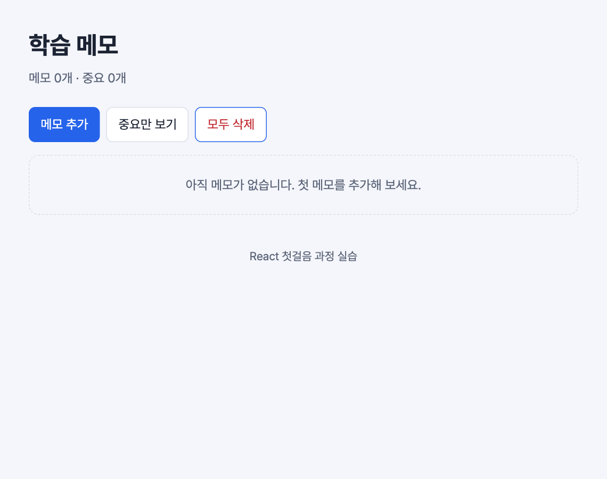
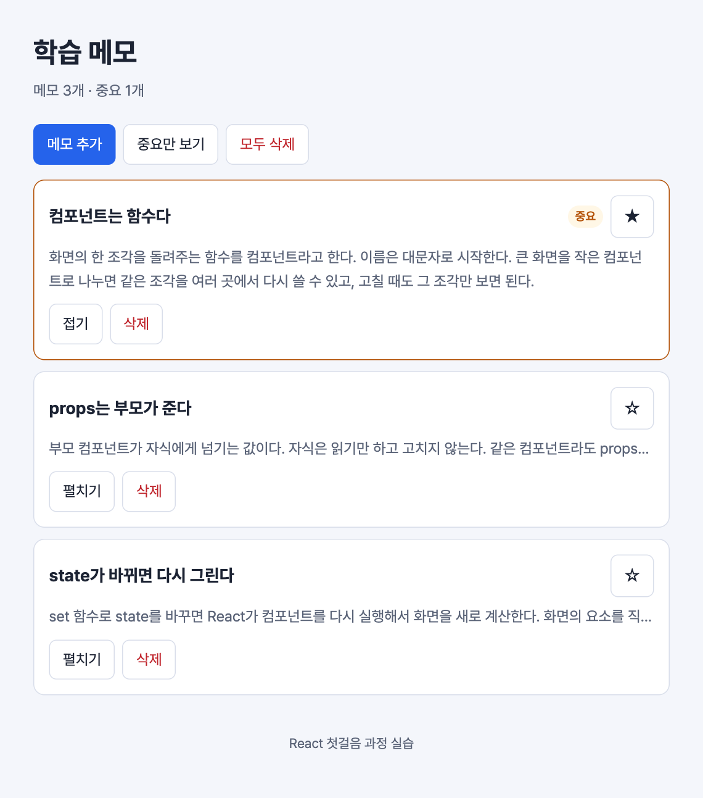

# 실습 5. 빈 상태 화면

2일 차 · 10분 · 시작 상태: `lab4`

## 이번 실습에서 만드는 것

메모가 하나도 없을 때 빈 화면 대신 안내 문구를 보여 준다. 중요한 메모에는 "중요" 배지를 붙인다.



## 단계

### 1. 메모가 없으면 안내 문구 보여 주기 — 삼항 연산자

`App.tsx`의 `<NoteList … />`를 아래처럼 감싼다.

```tsx
// src/App.tsx
{notes.length === 0 ? (
  <p className="empty">아직 메모가 없습니다. 첫 메모를 추가해 보세요.</p>
) : (
  <NoteList
    notes={notes}
    onDelete={handleDelete}
    onToggleImportant={handleToggleImportant}
  />
)}
```

- `조건 ? A : B` — 조건이 참이면 A를, 아니면 B를 그린다. 둘 중 하나를 골라야 할 때 쓴다.

**화면에서 볼 것**: 카드를 모두 삭제하면 안내 문구가 나오고, "메모 추가"를 누르면 다시 목록이 나온다.

### 2. 중요한 메모에 배지 붙이기 — &&

`NoteCard.tsx`의 `note-head` 안, 제목(`<h2>`)과 별 버튼 사이에 한 줄을 추가한다.

```tsx
// src/components/NoteCard.tsx
<h2 className="note-title">{note.title}</h2>
{note.isImportant && <span className="badge">중요</span>}
```

- `조건 && A` — 조건이 참일 때만 A를 그린다. 있거나 없거나 둘 중 하나일 때 쓴다.

**화면에서 볼 것**: 별을 켠 카드에만 "중요" 배지가 보인다.



**설명해 보기**

1. 안내 문구를 보여 줄지 말지를 정하는 state를 따로 만들지 않았다. 무엇으로 정해지는가?
2. `?:`와 `&&`를 각각 언제 쓰는지 한 문장씩 말해 본다.

## 확인 항목

- [ ] 메모를 모두 삭제하면 안내 문구가 보인다.
- [ ] 메모를 추가하면 안내 문구가 사라지고 목록이 보인다.
- [ ] 중요 표시한 카드에만 배지가 보인다.

## 막혔을 때

| 증상 | 확인할 것 |
| --- | --- |
| `식이 필요합니다` 또는 괄호 관련 오류 | `{조건 ? ( … ) : ( … )}`의 중괄호와 괄호 짝을 확인한다. 가이드의 코드를 통째로 다시 붙여 본다 |
| 화면에 숫자 `0`이 찍힌다 | `{notes.length && …}`처럼 숫자를 조건으로 썼다. `{notes.length > 0 && …}`로 고친다 |
| 안내 문구와 목록이 둘 다 보인다 | `<NoteList>`가 삼항 연산자 밖에 하나 더 남아 있다 |

## 도전 과제

"중요만 보기" 버튼을 만든다. 켜져 있으면 중요한 메모만 보여 준다.

```tsx
// src/App.tsx — notes state 아래
const [showImportantOnly, setShowImportantOnly] = useState(false);

const importantCount = notes.filter((note) => note.isImportant).length;
const visibleNotes = showImportantOnly ? notes.filter((note) => note.isImportant) : notes;
```

```tsx
// src/App.tsx — toolbar 안, "메모 추가" 버튼 바로 아래 ("모두 삭제" 버튼이 있다면 그 위)
<button
  type="button"
  className={showImportantOnly ? 'btn is-active' : 'btn'}
  aria-pressed={showImportantOnly}
  onClick={() => setShowImportantOnly(!showImportantOnly)}
>
  중요만 보기
</button>
```

```tsx
// src/App.tsx — 1단계의 코드를 아래로 바꾼다
{visibleNotes.length === 0 ? (
  <p className="empty">
    {notes.length === 0
      ? '아직 메모가 없습니다. 첫 메모를 추가해 보세요.'
      : '중요 표시한 메모가 없습니다.'}
  </p>
) : (
  <NoteList
    notes={visibleNotes}
    onDelete={handleDelete}
    onToggleImportant={handleToggleImportant}
  />
)}
```

- 걸러 낸 목록(`visibleNotes`)을 state로 따로 저장하지 않는다. `notes`와 `showImportantOnly`에서 계산한다.
- 제목 아래의 개수는 걸러 내기 전의 `notes`로 센다.
