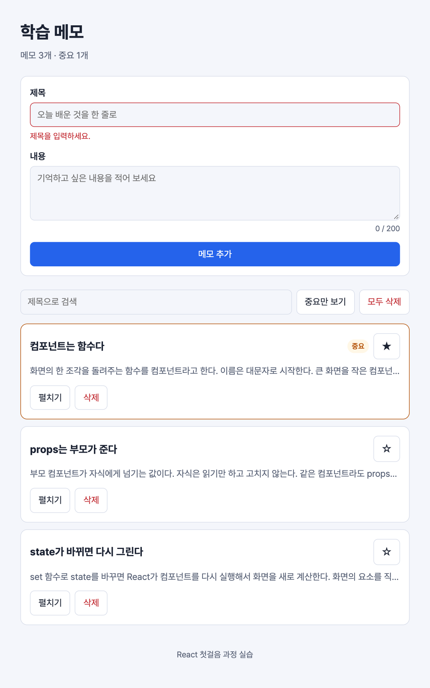

# 실습 6. 메모 작성 폼

3일 차 · 25분 · 시작 상태: `lab5`

## 이번 실습에서 만드는 것

제목과 내용을 직접 입력해서 메모를 추가하는 폼을 만든다. 제목이 비어 있으면 오류 메시지를 보여 주고 추가하지 않는다.



입력칸의 값을 state에 묶는 방식을 **controlled input**이라고 한다.

```
글자 입력 → onChange → setTitle → 다시 렌더링 → 입력칸에 title 표시
```

입력칸에 보이는 값이 항상 state와 같다. 그래서 검증, 글자 수 표시, 제출 후 비우기를 모두 state로 처리할 수 있다.

## 단계

### 1. 입력칸을 state에 묶기

`NoteForm.tsx`를 새로 만든다. 먼저 제목과 내용 입력만 넣는다.

```tsx
// src/components/NoteForm.tsx
import { useState } from 'react';

const BODY_MAX = 200;

export default function NoteForm() {
  const [title, setTitle] = useState('');
  const [body, setBody] = useState('');

  return (
    <form className="note-form" noValidate>
      <div className="field">
        <label className="field-label" htmlFor="note-title">
          제목
        </label>
        <input
          id="note-title"
          className="input"
          value={title}
          onChange={(event) => setTitle(event.target.value)}
          placeholder="오늘 배운 것을 한 줄로"
        />
      </div>

      <div className="field">
        <label className="field-label" htmlFor="note-body">
          내용
        </label>
        <textarea
          id="note-body"
          className="input"
          value={body}
          onChange={(event) => setBody(event.target.value)}
          placeholder="기억하고 싶은 내용을 적어 보세요"
        />
        <p className="field-hint">
          {body.length} / {BODY_MAX}
        </p>
      </div>

      <button type="submit" className="btn btn-primary">
        메모 추가
      </button>
    </form>
  );
}
```

`App.tsx`에서 import하고 `<main>` 바로 안, toolbar 위에 넣는다.

```tsx
// src/App.tsx
import NoteForm from './components/NoteForm';
```

```tsx
// src/App.tsx
<main>
  <NoteForm />
  <div className="toolbar">
```

- `value={title}` — 입력칸에 보이는 값은 state다.
- `onChange={(event) => setTitle(event.target.value)}` — 글자를 칠 때마다 입력된 값으로 state를 바꾼다.
- `htmlFor`와 `id`를 맞추면 라벨을 눌렀을 때 그 입력칸에 커서가 간다. JSX에서는 `for` 대신 `htmlFor`라고 쓴다.

**화면에서 볼 것**: 내용을 입력하면 오른쪽 아래 글자 수가 바로 바뀐다. 아직 버튼을 누르면 페이지가 새로 고쳐지고 입력이 사라진다.

### 2. 제출 처리하기

`NoteForm`이 부모에게서 `onAdd` 함수를 받아, 제출할 때 부른다. `NoteForm`을 고치면 `App.tsx`의 `<NoteForm />`에 빨간 밑줄이 생긴다. 이 단계의 마지막에 `onAdd`를 넘기면 사라진다.

```tsx
// src/components/NoteForm.tsx — 맨 위
import { useState } from 'react';
import type { FormEvent } from 'react';

type Props = {
  onAdd: (title: string, body: string) => void;
};
```

```tsx
// src/components/NoteForm.tsx — 컴포넌트
export default function NoteForm({ onAdd }: Props) {
  const [title, setTitle] = useState('');
  const [body, setBody] = useState('');

  function handleSubmit(event: FormEvent<HTMLFormElement>) {
    event.preventDefault();

    onAdd(title.trim(), body.trim());
    setTitle('');
    setBody('');
  }

  return (
    <form className="note-form" onSubmit={handleSubmit} noValidate>
```

`App.tsx`의 `handleAdd` 함수를 아래 내용으로 통째로 바꾸고, toolbar에 있던 "메모 추가" 버튼은 지운다. 버튼을 지워 `<div className="toolbar">` 안이 비어도 그대로 둔다.

```tsx
// src/App.tsx
function handleAdd(title: string, body: string) {
  const newNote: Note = { id: Date.now(), title, body, isImportant: false };
  setNotes([newNote, ...notes]);
}
```

```tsx
// src/App.tsx
<NoteForm onAdd={handleAdd} />
```

- `event.preventDefault()` — 폼을 제출하면 브라우저가 페이지를 새로 고친다. 그 기본 동작을 막는다.
- `FormEvent<HTMLFormElement>`는 "폼에서 일어난 이벤트"라는 타입 표기다. 그대로 붙여 쓴다.
- `trim()`은 앞뒤 공백을 없앤다.
- 제출 뒤 `setTitle('')`로 state를 비우면 입력칸도 비워진다.

**화면에서 볼 것**: 제목과 내용을 입력하고 버튼을 누르면(또는 제목 칸에서 Enter) 맨 위에 카드가 생기고 입력칸이 비워진다. 제목을 비운 채 눌러도 빈 카드가 생긴다. 다음 단계에서 막는다.

### 3. 검증하기

컴포넌트 **바깥**(함수 위)에 검증 함수를 추가한다.

```tsx
// src/components/NoteForm.tsx — type Props 아래
type FormErrors = {
  title?: string;
  body?: string;
};

const TITLE_MAX = 30;
const BODY_MAX = 200;

function validateTitle(title: string): string | undefined {
  const trimmed = title.trim();
  if (trimmed === '') return '제목을 입력하세요.';
  if (trimmed.length > TITLE_MAX) return `제목은 ${TITLE_MAX}자까지 쓸 수 있습니다.`;
  return undefined;
}

function validateBody(body: string): string | undefined {
  if (body.length > BODY_MAX) return `내용은 ${BODY_MAX}자까지 쓸 수 있습니다.`;
  return undefined;
}
```

(1단계에서 적은 `const BODY_MAX = 200;`이 두 번 있지 않게 한다.)

오류를 담을 state를 추가하고, 2단계의 `handleSubmit` 함수를 아래 내용으로 통째로 바꾼다.

```tsx
// src/components/NoteForm.tsx — 컴포넌트 안
const [errors, setErrors] = useState<FormErrors>({});

function handleSubmit(event: FormEvent<HTMLFormElement>) {
  event.preventDefault();

  const nextErrors: FormErrors = {
    title: validateTitle(title),
    body: validateBody(body),
  };
  setErrors(nextErrors);
  if (nextErrors.title || nextErrors.body) return;

  onAdd(title.trim(), body.trim());
  setTitle('');
  setBody('');
}
```

오류가 있으면 입력칸 아래에 보여 준다. 제목 입력칸은 아래처럼 된다.

```tsx
// src/components/NoteForm.tsx
<input
  id="note-title"
  className={errors.title ? 'input has-error' : 'input'}
  aria-invalid={Boolean(errors.title)}
  value={title}
  onChange={(event) => setTitle(event.target.value)}
  placeholder="오늘 배운 것을 한 줄로"
/>
{errors.title && (
  <p className="field-error" role="alert">
    {errors.title}
  </p>
)}
```

내용 입력칸도 같은 방법으로 고친다. 오류 문구는 글자 수 표시 아래에 넣는다.

```tsx
// src/components/NoteForm.tsx
<textarea
  id="note-body"
  className={errors.body ? 'input has-error' : 'input'}
  aria-invalid={Boolean(errors.body)}
  value={body}
  onChange={(event) => setBody(event.target.value)}
  placeholder="기억하고 싶은 내용을 적어 보세요"
/>
<p className="field-hint">
  {body.length} / {BODY_MAX}
</p>
{errors.body && (
  <p className="field-error" role="alert">
    {errors.body}
  </p>
)}
```

- `title?: string`의 `?`는 "있을 수도 있고 없을 수도 있다"는 뜻이다. 오류가 없으면 값이 없다.
- `string | undefined`는 "글자이거나 없음"이라는 뜻이다.
- `aria-invalid`와 `role="alert"`는 화면을 보지 못하는 사용자에게 오류를 알려 준다.

**화면에서 볼 것**: 제목을 비우고 제출하면 빨간 테두리와 "제목을 입력하세요."가 보이고 메모는 추가되지 않는다. 제목을 쓰고 다시 제출하면 오류가 사라지고 카드가 생긴다.

**설명해 보기**

1. 입력칸에 글자 하나를 쳤을 때 일어나는 일을 순서대로 말해 본다.
2. 제출 뒤 입력칸을 비우려고 입력칸 요소를 찾아서 고치지 않았다. 무엇을 바꿨는가?
3. 실습 5의 `&&`가 이번 실습에서 어디에 다시 쓰였는가?

## 확인 항목

- [ ] 내용을 입력하면 글자 수가 바로 바뀐다.
- [ ] 제목 없이 제출하면 오류 메시지가 보이고 메모가 추가되지 않는다.
- [ ] 제목을 입력하고 제출하면 맨 위에 카드가 생기고 입력칸이 비워진다.
- [ ] 내용을 200자 넘게 쓰고 제출하면 오류가 보인다.
- [ ] 제목 칸에서 Enter를 눌러도 제출된다.

## 막혔을 때

| 증상 | 확인할 것 |
| --- | --- |
| 입력칸에 글자가 안 쳐진다 | `value`만 있고 `onChange`가 없다. 콘솔에 `You provided a value prop … without an onChange handler` 경고가 나온다 |
| 제출하면 화면이 깜빡이며 입력이 사라진다 | `event.preventDefault()`가 빠졌거나, `<form>`에 `onSubmit={handleSubmit}`이 없다 |
| 버튼을 눌러도 아무 일도 없다 | 버튼이 `type="submit"`이고 `<form>` 안에 있는지 확인한다 |
| `'onAdd' 속성이 … 필수입니다` | `App.tsx`에서 `<NoteForm onAdd={handleAdd} />`로 넘겼는지 확인한다 |
| toolbar의 `onClick={handleAdd}` 줄에 `… 형식은 'MouseEventHandler<HTMLButtonElement>' 형식에 할당할 수 없습니다` | 예전 "메모 추가" 버튼이 남아 있다. 그 버튼을 지운다 |
| `'BODY_MAX' 블록 범위 변수를 다시 선언할 수 없습니다` | `const BODY_MAX`가 두 번 적혀 있다. 하나를 지운다 |

## 도전 과제

제목으로 메모를 검색한다. 검색어도 controlled input이다.

```tsx
// src/App.tsx — state 추가, visibleNotes 계산 바꾸기
const [query, setQuery] = useState('');

const keyword = query.trim().toLowerCase();
const visibleNotes = notes
  .filter((note) => !showImportantOnly || note.isImportant)
  .filter((note) => note.title.toLowerCase().includes(keyword));
```

```tsx
// src/App.tsx — toolbar 맨 앞
<input
  className="input"
  type="search"
  aria-label="제목으로 검색"
  placeholder="제목으로 검색"
  value={query}
  onChange={(event) => setQuery(event.target.value)}
/>
```

걸러진 결과가 없을 때의 문구도 `'조건에 맞는 메모가 없습니다.'`로 바꾼다. 검색어 때문에 비었을 수도 있기 때문이다.

(실습 5의 도전 과제를 하지 않았다면 `showImportantOnly`가 없다. 첫 번째 `filter` 줄을 빼고, `<NoteList notes={visibleNotes} … />`로 바꾼다.)
