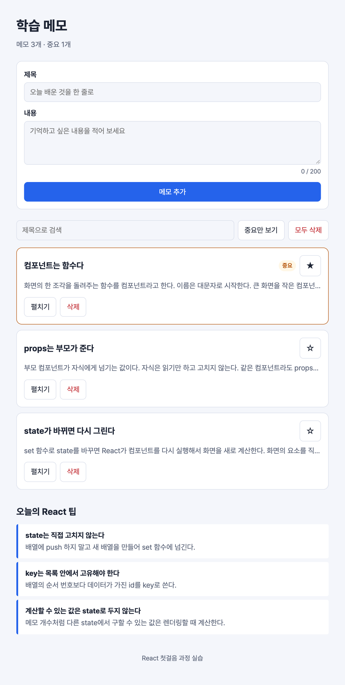

# 실습 7. 저장하기와 불러오기

3일 차 · 25분 · 시작 상태: `lab6`

## 이번 실습에서 만드는 것

(a) 메모를 브라우저에 저장해서 새로 고쳐도 남아 있게 한다.
(b) "오늘의 React 팁"을 파일에서 불러와 보여 준다. 불러오는 중, 실패, 빈 목록, 성공을 각각 다른 화면으로 그린다.



저장과 요청은 화면을 계산하는 일이 아니다. 이런 "렌더링 바깥의 일"은 `useEffect` 안에서 한다.

```
렌더링(컴포넌트 함수 실행) → 화면 반영 → effect 실행
```

## (a) 메모 저장하기 — 10분

### 1. 준비된 함수 읽기

`src/storage.ts`를 열어 두 함수가 무엇을 하는지만 읽는다. 고치지 않는다.

| 함수 | 하는 일 |
| --- | --- |
| `loadNotes()` | 저장된 메모를 읽어 돌려준다. 저장된 것이 없으면 예시 메모를 돌려준다 |
| `saveNotes(notes)` | 메모 배열을 저장한다 |

`localStorage`는 브라우저가 사이트마다 제공하는 작은 저장소다. 글자만 저장할 수 있어서 `JSON.stringify`로 배열을 글자로 바꿔 저장한다.

### 2. notes가 바뀔 때마다 저장하기

`App.tsx`의 세 군데를 고친다.

```tsx
// src/App.tsx — import
import { useEffect, useState } from 'react';
import { loadNotes, saveNotes } from './storage';
```

`sampleNotes` import는 이제 쓰지 않으므로 지운다.

```tsx
// src/App.tsx — 컴포넌트 안
const [notes, setNotes] = useState<Note[]>(loadNotes);

useEffect(() => {
  saveNotes(notes);
}, [notes]);
```

- `useState<Note[]>(loadNotes)` — 처음 값을 저장소에서 읽어 온다. `loadNotes()`가 아니라 함수 자체를 넘긴다. 그러면 처음 그릴 때만 읽는다.
- `useEffect(함수, [notes])` — 화면을 그린 뒤, **`notes`가 바뀌었을 때만** 함수를 실행한다. `[notes]`를 의존성 배열이라고 한다.

**화면에서 볼 것**: 메모를 추가하거나 삭제한 뒤 새로 고쳐도(F5) 그대로 남아 있다.

### 3. 저장된 값 직접 보기

브라우저 개발자 도구(F12) → **Application**(응용 프로그램) 탭 → **Local Storage** → `http://localhost:5173`을 연다.

**화면에서 볼 것**: `memo-app:notes`라는 이름으로 메모가 글자로 저장돼 있다. 별을 누르면 값이 바로 바뀐다.

처음 상태로 되돌리고 싶으면 그 항목을 지우고 새로 고친다.

## (b) 팁 불러오기 — 15분

### 4. 준비된 파일 읽기

| 파일 | 내용 |
| --- | --- |
| `public/tips.json` | 팁 3개가 들어 있는 데이터. 브라우저에서 `http://localhost:5173/tips.json`으로 열어 볼 수 있다 |
| `src/api/tips.ts` | `fetchTips(url)` — 주소에서 팁 목록을 받아 온다. 실패하면 오류를 던진다. 로딩 화면을 볼 수 있게 일부러 0.8초 기다린다 |

실제 서비스에서는 이 주소가 백엔드 서버의 주소가 된다. 컴포넌트가 하는 일은 같다.

### 5. TipList 컴포넌트 만들기

```tsx
// src/components/TipList.tsx
import { useEffect, useState } from 'react';
import { fetchTips } from '../api/tips';
import type { Tip } from '../types';

type Status = 'loading' | 'success' | 'error';

const TIPS_URL = '/tips.json';

export default function TipList() {
  const [status, setStatus] = useState<Status>('loading');
  const [tips, setTips] = useState<Tip[]>([]);

  useEffect(() => {
    let isCancelled = false;

    fetchTips(TIPS_URL)
      .then((data) => {
        if (isCancelled) return;
        setTips(data);
        setStatus('success');
      })
      .catch((error: unknown) => {
        if (isCancelled) return;
        console.error('팁을 불러오지 못했습니다.', error);
        setStatus('error');
      });

    return () => {
      isCancelled = true;
    };
  }, []);

  return (
    <section className="tips">
      <h2 className="tips-title">오늘의 React 팁</h2>

      {status === 'loading' && (
        <p className="state" role="status">
          불러오는 중…
        </p>
      )}

      {status === 'error' && (
        <div className="state is-error" role="alert">
          <p>팁을 불러오지 못했습니다.</p>
        </div>
      )}

      {status === 'success' && tips.length === 0 && (
        <p className="state">아직 등록된 팁이 없습니다.</p>
      )}

      {status === 'success' && tips.length > 0 && (
        <ul className="tip-list">
          {tips.map((tip) => (
            <li key={tip.id} className="tip-item">
              <strong>{tip.title}</strong>
              <span>{tip.summary}</span>
            </li>
          ))}
        </ul>
      )}
    </section>
  );
}
```

`App.tsx`에서 import하고 `</main>` 바로 위에 넣는다.

```tsx
// src/App.tsx
import TipList from './components/TipList';
```

```tsx
// src/App.tsx
  <TipList />
</main>
```

읽는 순서:

- `type Status = 'loading' | 'success' | 'error'` — `status`에는 이 세 글자 중 하나만 들어갈 수 있다. 오타를 내면 빨간 밑줄이 생긴다.
- `useEffect(…, [])` — 의존성 배열이 비어 있으면 **처음 화면에 나타날 때 한 번** 실행한다.
- `.then(…)`은 성공했을 때, `.catch(…)`는 실패했을 때 실행된다.
- `isCancelled`와 `return () => {…}`은 "응답이 오기 전에 이 컴포넌트가 사라졌으면 그 응답은 무시한다"는 안전장치다. 그대로 붙여 쓴다.
- 아래쪽 JSX는 `status`에 따라 네 가지 화면 중 하나를 그린다.

**화면에서 볼 것**: 새로 고치면 "불러오는 중…"이 잠깐 보였다가 팁 3개가 나온다.

### 6. 네 가지 상태를 모두 확인하기

`TIPS_URL`을 바꿔 가며 각 화면을 본다.

| `TIPS_URL` | 화면 |
| --- | --- |
| `'/tips.json'` | 로딩 → 팁 3개 |
| `'/tips-empty.json'` | 로딩 → "아직 등록된 팁이 없습니다." |
| `'/tips-wrong.json'` (없는 주소) | 로딩 → "팁을 불러오지 못했습니다." |

에러 상태일 때 콘솔(F12)을 열면 자세한 오류가 찍혀 있다. 사용자에게는 짧은 안내를, 개발자에게는 자세한 기록을 남긴다.

확인했으면 `'/tips.json'`으로 되돌린다.

**설명해 보기**

1. `[notes]`와 `[]`는 각각 effect를 언제 실행하게 하는가?
2. `saveNotes(notes)`를 effect에 넣지 않고 `handleAdd`, `handleDelete`, `handleToggleImportant`에 각각 넣을 수도 있다. effect에 두면 무엇이 편한가?
3. 팁이 없는 것(빈 상태)과 불러오지 못한 것(에러)은 사용자에게 어떻게 다르게 보여야 하는가?

## 확인 항목

- [ ] 메모를 추가·삭제하고 새로 고쳐도 그대로 남아 있다.
- [ ] 개발자 도구의 Local Storage에서 저장된 값을 확인했다.
- [ ] 새로 고치면 "불러오는 중…" 뒤에 팁 3개가 보인다.
- [ ] 주소를 바꿔 빈 상태와 에러 상태 화면을 확인하고 되돌렸다.

## 막혔을 때

| 증상 | 확인할 것 |
| --- | --- |
| 새로 고치면 메모가 처음으로 돌아간다 | `useState<Note[]>(loadNotes)`로 바꿨는지, `useEffect`의 `saveNotes(notes)`가 있는지 확인한다 |
| `sampleNotes` import 줄이 흐리게 보인다 | 이제 쓰지 않는 import라는 표시다. 오류는 아니지만 그 줄을 지운다 |
| "불러오는 중…"에서 멈춰 있다 | `.then` 안에 `setStatus('success')`가 있는지 확인한다 |
| 개발자 도구 Network 탭에 `tips.json` 요청이 2번 보인다 | 정상이다. 개발 모드의 React는 effect를 일부러 한 번 더 실행해서 문제를 찾는다. 배포판에서는 한 번만 실행된다 |
| 없는 주소인데 콘솔 오류가 `Unexpected token '<'`다 | 정상이다. 개발 서버는 없는 주소에 HTML을 돌려주고, 그것을 JSON으로 읽으려다 실패한 것이다. 화면은 똑같이 에러 상태가 된다 |
| 메모가 이상하게 저장돼 처음으로 돌리고 싶다 | 개발자 도구 → Application → Local Storage에서 `memo-app:notes`를 지우고 새로 고친다 |

## 도전 과제

에러 화면에 "다시 시도" 버튼을 만든다.

```tsx
// src/components/TipList.tsx — state 추가
const [retryCount, setRetryCount] = useState(0);
```

```tsx
// src/components/TipList.tsx — 의존성 배열을 [] 에서 아래로 바꾼다
}, [retryCount]);
```

```tsx
// src/components/TipList.tsx — useEffect 아래
function handleRetry() {
  setStatus('loading');
  setRetryCount(retryCount + 1);
}
```

```tsx
// src/components/TipList.tsx — 에러 화면
<div className="state is-error" role="alert">
  <p>팁을 불러오지 못했습니다.</p>
  <button type="button" className="btn" onClick={handleRetry}>
    다시 시도
  </button>
</div>
```

`retryCount`가 바뀌면 effect가 다시 실행되어 요청을 새로 보낸다. `TIPS_URL`을 없는 주소로 바꾸고 버튼을 눌러 "불러오는 중…"이 다시 나오는지 확인한다.

## 마무리 실습

시간이 남으면 아래에서 하나를 골라 해 본다. 정답 코드는 없다.

- 메모 제목 옆에 글자 수를 보여 준다. (힌트: `note.body.length`)
- 중요한 메모가 항상 위에 오도록 정렬한다. (힌트: `[...visibleNotes].sort(…)` — 원본 배열을 바꾸지 않게 복사한 뒤 정렬한다)
- `public/tips.json`에 팁을 하나 추가한다.
