# React 첫걸음

## 1일 차 — 화면을 컴포넌트로 나눈다

2시간 × 3일, 메모 앱 하나를 같이 만듭니다

---

## 3일 동안 갈 길

| 일차 | 주제 | 끝나면 되는 것 |
| --- | --- | --- |
| **1일** | **컴포넌트, props** | **메모 카드 목록이 보인다** |
| 2일 | state, 이벤트 | 메모를 추가·삭제한다 |
| 3일 | 폼, useEffect | 입력하고, 저장하고, 불러온다 |

오늘의 목표

- React가 어떤 문제를 푸는지 말할 수 있다
- 화면을 컴포넌트로 나눌 수 있다
- props로 데이터를 내려보낼 수 있다

---

## 3일 뒤에 만들어져 있을 것


(강사 시연: 메모 추가 → 중요 표시 → 검색 → 새로 고침)

---

<!-- 이론 1 -->

# 이론 1. React가 필요한 이유

---

## 웹 앱은 이렇게 생겼다



- 이 과정에서 배우는 곳은 **브라우저 안, 화면을 만드는 부분**이다
- 백엔드와 배포는 3일 차 마지막에 이 그림으로 다시 본다

---

## React 없이 화면을 바꾸면

"좋아요 버튼을 누르면 숫자가 올라간다"

```js
let count = 0;

button.addEventListener('click', () => {
  count = count + 1;
  document.querySelector('#count').textContent = count;      // 숫자 고치기
  document.querySelector('#badge').style.display = 'block';  // 배지 보이기
  document.querySelector('#title').textContent = `좋아요 ${count}`; // 제목도 고치기
});
```

- 데이터를 바꾸고, **바뀐 데이터가 보이는 곳을 전부 찾아서 직접 고친다**
- 한 곳이라도 빠뜨리면 화면과 데이터가 어긋난다

---

## React의 방식



- 우리는 **데이터(state)만 바꾼다**
- 화면은 React가 데이터에 맞춰 다시 계산한다

---

## 오늘 기억할 한 문장

> **화면은 데이터로부터 계산된다.**

```
화면 = 컴포넌트(데이터)
```

- "이 요소를 찾아서 고쳐라"가 아니라
- "데이터가 이럴 때 화면은 이렇게 생겼다"라고 적는다

---

<!-- 이론 1-2 -->

# 이론 1-2. JavaScript와 TypeScript

---

## TypeScript = JavaScript + 타입 표기

```js
// JavaScript
function greet(name) {
  return '안녕하세요, ' + name;
}
greet(42); // 실행은 되지만 의도한 것이 아니다
```

```ts
// TypeScript
function greet(name: string) {
  return '안녕하세요, ' + name;
}
greet(42); // 실행하기 전에 편집기가 빨간 밑줄로 알려 준다
```

- 달라진 것은 `: string` 하나다. "`name`에는 글자가 들어온다"는 표기
- 나머지 문법은 JavaScript와 같다

---

## 브라우저는 TypeScript를 모른다



- 타입 표기는 **실행 전에 검사**하는 데만 쓰이고, 변환하면서 지워진다
- 브라우저에서 돌아가는 것은 결국 JavaScript다
- 파일 확장자: `.ts`(TypeScript), `.tsx`(TypeScript + 화면 코드)

---

## 이 과정에서 읽을 타입은 세 가지

```ts
// 1. 데이터의 모양
type Note = { id: number; title: string; body: string; isImportant: boolean };

// 2. 컴포넌트가 받는 값(props)의 모양
type Props = { note: Note };

// 3. state에 들어갈 값의 종류
useState<Note[]>([]);
```

- 문법을 외우지 않는다. **가이드에 적힌 대로 쓰고, 읽을 수 있으면 된다**
- 빨간 밑줄이 생기면 마우스를 올려 메시지를 읽는다

---

# 실습 0. 실습 프로젝트 실행하기

13분 · `labs/lab0-start.md`

- 프로젝트를 실행한다
- 글자를 고쳐 화면이 바로 바뀌는 것을 본다
- 일부러 오류를 내고 메시지를 읽어 본다

---

<!-- 이론 2 -->

# 이론 2. JSX와 컴포넌트

---

## JSX — JavaScript 안에 쓰는 화면 코드

```tsx
export default function App() {
  return (
    <div className="app">
      <h1>학습 메모</h1>
    </div>
  );
}
```

- HTML처럼 생겼지만 JavaScript 코드다
- 함수가 "화면이 이렇게 생겼다"를 **돌려준다(return)**

---

## JSX 규칙 세 가지

```tsx
const count = 3;

return (
  <div className="app">          {/* 1. 가장 바깥 태그는 하나 */}
    <h1 className="title">메모</h1> {/* 2. class 대신 className */}
    <p>메모 {count}개</p>          {/* 3. { } 안에는 JavaScript 값 */}
            {/* 태그는 반드시 닫는다 */}
  </div>
);
```

---

## 컴포넌트 — 화면의 한 조각을 돌려주는 함수

```tsx
function Header() {
  return <h1>학습 메모</h1>;
}

function App() {
  return (
    <div>
      <Header />
      <Header />
    </div>
  );
}
```

- 이름은 **대문자**로 시작한다
- 만든 컴포넌트는 태그처럼 쓴다: `<Header />`
- 한 번 만들면 여러 번 쓸 수 있다

---

## 메모 앱의 컴포넌트 트리


- 큰 화면을 작은 조각으로 나누면, 고칠 때 그 조각만 보면 된다
- 나누는 기준: **이름을 붙일 수 있는 덩어리**, **반복되는 덩어리**

---

## 파일 하나에 컴포넌트 하나

```tsx
// src/components/Header.tsx
export default function Header() {
  return <h1>학습 메모</h1>;
}
```

```tsx
// src/App.tsx
import Header from './components/Header';
```

- `export default` — 다른 파일에서 쓸 수 있게 내보낸다
- `import` — 가져온다. 경로는 지금 파일 기준(`./`)

---

# 휴식 10분

---

# 실습 1. 화면을 컴포넌트로 나누기

23분 · `labs/lab1-components.md`

- `App.tsx`의 통짜 화면을 `Header`, `NoteList`, `NoteCard`로 나눈다
- 끝나면 카드 3장이 모두 같은 내용이 된다. 그게 정상이다

---

<!-- 이론 3 -->

# 이론 3. props와 목록

---

## props — 부모가 자식에게 주는 값

```tsx
// 부모: 값을 준다
<NoteCard title="컴포넌트는 함수다" />
<NoteCard title="props는 부모가 준다" />

// 자식: 받아서 쓴다
type Props = { title: string };

function NoteCard({ title }: Props) {
  return <h2>{title}</h2>;
}
```

- 함수에 인자를 넘기는 것과 같다
- 같은 컴포넌트라도 props가 다르면 다른 화면이 나온다

---

## props는 위에서 아래로만 흐른다


- 자식은 props를 **읽기만** 한다. 고치지 않는다
- 자식이 부모의 데이터를 바꾸고 싶을 때는? → 2일 차

---

## props의 타입이 하는 일

```tsx
type Props = { note: Note };
```

```tsx
<NoteCard />              // 빨간 밑줄: note를 안 줬다
<NoteCard note="메모" />   // 빨간 밑줄: 글자가 아니라 Note여야 한다
<NoteCard note={note} />  // 통과
```

- 컴포넌트를 **잘못 쓰면 실행하기 전에 알려 준다**
- 글자는 `title="…"`, 그 밖의 값은 `count={3}`, `note={note}`

---

## 배열을 목록으로 — map과 key

```tsx
const notes = [
  { id: 1, title: '컴포넌트는 함수다' },
  { id: 2, title: 'props는 부모가 준다' },
];

<ul>
  {notes.map((note) => (
    <NoteCard key={note.id} note={note} />
  ))}
</ul>
```

- `map` — 데이터 배열을 컴포넌트 배열로 바꾼다
- `key` — React가 항목을 구별하는 이름표. 목록 안에서 겹치지 않는 값(`id`)

---

# 실습 2. props로 메모 목록 그리기

15분 · `labs/lab2-props.md`

- `NoteCard`가 `note`를 받아서 그린다
- `NoteList`가 배열을 `map`으로 그린다
- 데이터 파일에 메모를 추가하면 카드가 늘어난다

---

## 오늘 정리

| 개념 | 한 문장 |
| --- | --- |
| React | 데이터만 바꾸면 화면은 React가 맞춰 준다 |
| TypeScript | JavaScript에 타입 표기를 더해, 실행 전에 오류를 잡는다 |
| JSX | JavaScript 안에 쓰는 화면 코드 |
| 컴포넌트 | 화면의 한 조각을 돌려주는 함수 |
| props | 부모가 자식에게 주는 읽기 전용 값 |
| key | 목록의 항목을 구별하는 이름표 |

---

## 복습 과제

React Playground — https://codyssey-b1-2-react.vercel.app

- 레슨 1. 컴포넌트는 왜 필요한가
- 레슨 2. props와 state, 상태는 어디에 두나
- 레슨마다 끝에 있는 퀴즈 3문항

**내일**: 버튼을 누르면 화면이 바뀐다 — state와 이벤트
