# React 첫걸음

## 3일 차 — 폼, 효과, 외부 데이터

---

## 복습 퀴즈 (10분)

`handouts/quiz.md`의 2일 차 5문항

1. state를 바꿀 때 반드시 써야 하는 것은?
2. 버튼을 눌렀을 때 화면이 바뀌기까지의 순서는?
3. 배열 state에 항목을 추가하는 코드는?
4. `Header`와 `NoteCard`가 같은 데이터를 써야 하면 state를 어디에 두는가?
5. `{count && <p>…</p>}`에서 `count`가 0이면 화면에 무엇이 나오는가?

---

## 오늘 갈 길

| 일차 | 주제 | 끝나면 되는 것 |
| --- | --- | --- |
| 1일 | 컴포넌트, props | 메모 카드 목록이 보인다 |
| 2일 | state, 이벤트 | 메모를 추가·삭제한다 |
| **3일** | **폼, useEffect** | **입력하고, 저장하고, 불러온다** |

마지막 15분에는 이 앱이 실제 서비스가 되려면 무엇이 더 필요한지 본다

---

<!-- 이론 7 -->

# 이론 7. 폼과 검증

---

## controlled input — 입력칸을 state에 묶는다

```tsx
const [title, setTitle] = useState('');

<input
  value={title}
  onChange={(event) => setTitle(event.target.value)}
/>
```

```
글자 입력 → onChange → setTitle → 다시 렌더링 → 입력칸에 title 표시
```

- 입력칸에 보이는 값이 **항상 state와 같다**
- 어제 배운 "이벤트 → state → 렌더링"과 같은 흐름이다

---

## state에 묶으면 할 수 있는 것

```tsx
<p>{body.length} / 200</p>                 {/* 글자 수 표시 */}

if (title.trim() === '') { … }             // 검증

setTitle('');                              // 제출 후 비우기
```

- 입력칸 요소를 찾아서 읽거나 고칠 필요가 없다
- 전부 **state를 읽고, state를 바꾸는 일**이 된다

---

## 제출 처리

```tsx
function handleSubmit(event: FormEvent<HTMLFormElement>) {
  event.preventDefault();   // 페이지가 새로 고쳐지는 기본 동작을 막는다

  onAdd(title.trim(), body.trim());
  setTitle('');
  setBody('');
}

<form onSubmit={handleSubmit}>
  …
  <button type="submit">메모 추가</button>
</form>
```

- 버튼의 `onClick`이 아니라 폼의 `onSubmit`에 건다. Enter 키로도 제출된다
- `FormEvent<HTMLFormElement>`는 "폼 이벤트"라는 타입 표기. 그대로 쓴다

---

## 검증 — 오류도 state다

```tsx
const [errors, setErrors] = useState<FormErrors>({});

function handleSubmit(event: FormEvent<HTMLFormElement>) {
  event.preventDefault();

  const nextErrors = { title: validateTitle(title), body: validateBody(body) };
  setErrors(nextErrors);
  if (nextErrors.title || nextErrors.body) return;   // 오류가 있으면 여기서 멈춘다

  onAdd(title.trim(), body.trim());
}
```

```tsx
{errors.title && <p className="field-error">{errors.title}</p>}
```

- 검사 → 오류를 state에 저장 → 조건부 렌더링으로 표시

---

## 좋은 오류 메시지

| 나쁜 예 | 좋은 예 |
| --- | --- |
| 잘못된 입력입니다 | 제목을 입력하세요 |
| 오류 | 제목은 30자까지 쓸 수 있습니다 |

- **어느 칸**이, **무엇 때문에** 안 되는지 그 칸 바로 아래에 보여 준다
- 색만으로 알리지 않는다. 글로도 알린다

---

# 실습 6. 메모 작성 폼

25분 · `labs/lab6-form.md`

- 제목·내용 입력칸을 state에 묶는다
- 제출하면 메모가 추가되고 입력칸이 비워진다
- 제목이 비면 오류를 보여 준다

---

<!-- 이론 8 -->

# 이론 8. useEffect

---

## 렌더링 바깥의 일

컴포넌트 함수가 하는 일은 **화면을 계산하는 것**이다. 그런데 앱에는 다른 일도 있다.

- 브라우저 저장소에 저장하기
- 서버에 데이터 요청하기
- 타이머 걸기

이런 일을 **부수 효과(side effect)** 라고 하고, `useEffect` 안에서 한다.

---

## useEffect — 화면을 그린 뒤에 실행한다

```tsx
useEffect(() => {
  saveNotes(notes);   // 할 일
}, [notes]);          // 언제: notes가 바뀌었을 때
```


---

## 의존성 배열이 "언제"를 정한다

| 코드 | 실행 시점 |
| --- | --- |
| `useEffect(fn, [notes])` | 처음 + `notes`가 바뀔 때마다 |
| `useEffect(fn, [])` | 처음 화면에 나타날 때 한 번 |
| `useEffect(fn)` | 다시 그릴 때마다 매번 (거의 쓰지 않는다) |

- 배열에는 **effect 안에서 쓰는 state와 props**를 적는다

---

## 데이터 요청은 세 가지 결과가 있다


```tsx
type Status = 'loading' | 'success' | 'error';
const [status, setStatus] = useState<Status>('loading');
```

- 요청은 **시간이 걸리고, 실패할 수 있다**
- 성공했는데 **데이터가 0개**일 수도 있다 → 빈 상태

---

## 요청 코드 읽기

```tsx
useEffect(() => {
  fetchTips('/tips.json')
    .then((data) => {        // 성공하면
      setTips(data);
      setStatus('success');
    })
    .catch((error) => {      // 실패하면
      console.error(error);
      setStatus('error');
    });
}, []);                      // 처음 한 번
```

```tsx
{status === 'loading' && <p>불러오는 중…</p>}
{status === 'error' && <p>팁을 불러오지 못했습니다.</p>}
{status === 'success' && tips.length === 0 && <p>아직 등록된 팁이 없습니다.</p>}
{status === 'success' && tips.length > 0 && <ul>…</ul>}
```

---

## 개발 중에는 effect가 두 번 실행된다

- 개발 모드의 React(`StrictMode`)는 effect를 **일부러 한 번 더** 실행한다
- 두 번 실행해도 문제없는 코드인지 확인하려는 것이다
- 배포한 앱에서는 한 번만 실행된다

Network 탭에 요청이 2번 보여도 버그가 아니다

---

# 휴식 10분

---

# 실습 7. 저장하기와 불러오기

25분 · `labs/lab7-effect.md`

- (a) `notes`가 바뀔 때마다 localStorage에 저장
- (b) 팁을 불러오고 로딩·에러·빈 상태·성공을 각각 그린다

이어서 마무리 실습 7분: 밀린 단계를 따라잡거나 자유롭게 고쳐 본다

---

<!-- 이론 9 -->

# 이론 9. 실제 서비스로 넓히기

---

## 3일 동안 만든 것


- 화면 하나, 브라우저 안에서만 동작하는 앱
- 실제 서비스가 되려면 다섯 가지가 더 필요하다

---

## 메모 앱 → 실제 서비스

| 메모 앱에서는 | 실제 서비스에서는 | 이름 |
| --- | --- | --- |
| 화면이 하나 | 주소마다 다른 화면 | **라우팅** |
| 컴포넌트 안에 요청 코드 | 요청 흐름을 함수로 묶어 재사용 | **커스텀 훅** |
| `App`에서 props로 내려보냄 | 어디서든 꺼내 쓰는 공용 state | **전역 상태** |
| localStorage, `tips.json` | 로그인, 데이터베이스 | **백엔드** |
| 내 컴퓨터에서만 열림 | 누구나 주소로 접속 | **배포** |

---

## 같은 주제로 만든 실제 서비스 — React Playground



https://codyssey-b1-2-react.vercel.app · 복습 과제로 쓰던 그 사이트다

---

## 1. 라우팅 — 주소가 화면을 정한다

```tsx
<Routes>
  <Route path="/" element={<HomePage />} />
  <Route path="/lessons" element={<LessonListPage />} />
  <Route path="/lessons/:slug" element={<LessonDetailPage />} />
  <Route path="/notes" element={<NoteListPage />} />
</Routes>
```

- 주소(`/notes`)에 따라 어떤 컴포넌트를 그릴지 정한다
- 서버에서 새 페이지를 받아 오지 않고 **브라우저 안에서 화면만 바꾼다**
- 도구: React Router

---

## 2. 커스텀 훅 — 반복되는 흐름을 묶는다

실습 7의 `TipList`에 있던 것: `status`, 데이터, `useEffect`, 다시 시도

```tsx
// 묶기 전: 요청하는 컴포넌트마다 같은 코드를 반복한다
const [status, setStatus] = useState('loading');
const [tips, setTips] = useState([]);
useEffect(() => { … }, []);

// 묶은 뒤
const { status, data, refetch } = useAsync(fetcher, []);
```

- `use`로 시작하는 함수로 state와 effect를 묶은 것
- React Playground의 `useAsync`, `useNotes`가 이것이다

---

## 3. 전역 상태 — 어디서든 꺼내 쓴다

로그인한 사용자 정보는 헤더, 노트 목록, 프로필 등 **거의 모든 화면**이 쓴다.
props로 넘기면 중간 컴포넌트가 전부 전달만 해야 한다.

```tsx
// 맨 위에서 한 번 감싸고
<AuthProvider>
  <App />
</AuthProvider>

// 필요한 곳에서 바로 꺼낸다
const { user } = useAuth();
```

- React에 들어 있는 도구: **Context**
- React Playground에서는 로그인(`AuthContext`), 테마, 알림 메시지에 쓴다
- 앱이 더 커지면 상태 관리 라이브러리(Zustand, Redux 등)를 쓰기도 한다

---

## 4. 백엔드 — 데이터를 서버에 둔다

| | 메모 앱 | React Playground |
| --- | --- | --- |
| 저장 위치 | 내 브라우저(localStorage) | 데이터베이스 |
| 다른 기기에서 | 안 보인다 | 보인다 |
| 누구의 메모인가 | 구분 없음 | 로그인한 사용자 |

```ts
// 요청하는 코드의 모양은 실습 7의 fetchTips와 같다
const { data, error } = await supabase.from('notes').select('*');
```

- 컴포넌트 쪽은 달라지지 않는다. **로딩·에러·빈 상태·성공**을 그리는 것은 같다
- React Playground는 Supabase(인증 + 데이터베이스)를 쓴다

---

## 5. 배포 — 주소를 가진 서비스로

```bash
npm run build   # TypeScript 검사 → JavaScript, HTML, CSS 파일 묶음(dist)
```

- 빌드하면 브라우저가 읽을 수 있는 **정적 파일**이 나온다
- 이 파일을 호스팅 서비스에 올리면 주소가 생긴다
- React Playground는 Vercel에 올렸다. 코드를 올리면 자동으로 빌드하고 배포한다

---

## 전체 그림에서 다시 보기


- 3일 동안 배운 곳: 브라우저 안의 컴포넌트, state, 이벤트, effect
- 나머지는 **같은 흐름 위에 얹는 것**이다

---

## 3일 정리

```
화면은 데이터(state)로부터 계산된다.
이벤트가 state를 바꾸면, React가 화면을 다시 계산한다.
```

| 일차 | 배운 것 |
| --- | --- |
| 1일 | 컴포넌트로 나누고 props로 내려보낸다 |
| 2일 | state와 이벤트로 화면을 움직인다 |
| 3일 | 폼으로 입력받고, effect로 저장하고 불러온다 |

---

## 다음 단계

`handouts/next-steps.md`

1. React Playground 레슨 4, 6, 7 복습 → 레슨 5(라우팅), 8(커스텀 훅)
2. 메모 앱에 수정 기능 넣어 보기
3. React 공식 문서의 "빠르게 시작하기" — https://ko.react.dev/learn

**설문**: `handouts/survey.md` — 3분이면 됩니다. 고맙습니다.
